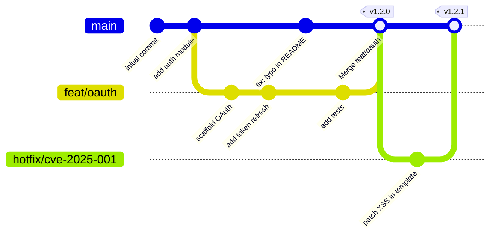
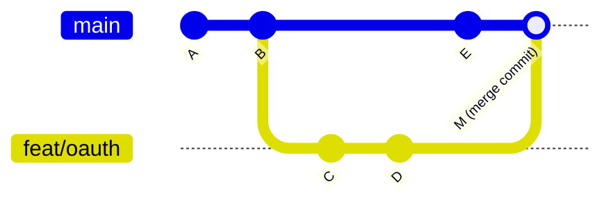

<div align="center">

# 01 · Git & GitHub Fundamentals

### Understanding the internals that power every command you run

[](./README.md)
[](./02-collaboration.md)

</div>

---

## Table of Contents

1. [Git vs GitHub — The Critical Distinction](#1-git-vs-github)
2. [The Git Object Model](#2-the-git-object-model)
3. [The `.git` Directory Anatomy](#3-the-git-directory)
4. [Commits in Depth](#4-commits-in-depth)
5. [Branches as Lightweight Pointers](#5-branches-as-pointers)
6. [HEAD and Detached HEAD State](#6-head)
7. [Merging Strategies](#7-merging-strategies)
8. [Rebasing — Rewriting History](#8-rebasing)
9. [Tags — Permanent Markers](#9-tags)
10. [Remotes and GitHub's Role](#10-remotes)
11. [Useful Plumbing Commands](#11-plumbing-commands)

---

## 1. Git vs GitHub

> **Note:** This distinction is critical and frequently misunderstood — even by experienced developers.

| | Git | GitHub |
|--|-----|--------|
| **What it is** | Distributed version control system | Cloud platform built on Git |
| **Created by** | Linus Torvalds, 2005 | Tom Preston-Werner et al., 2008 |
| **Runs on** | Your local machine | GitHub's servers (+ your machine via `gh`) |
| **Core function** | Track changes in files | Host repos + add collaboration layer |
| **Without the other** | Works completely standalone | Meaningless without Git repos |
| **Protocol** | Custom Git protocol, SSH, HTTPS | HTTPS, SSH, GitHub CLI |
| **Alternatives** | Mercurial, SVN, Fossil | GitLab, Bitbucket, Gitea |

**Key insight:** GitHub is not Git. It's a product that consumes Git repos and adds Issues, Pull Requests, Actions, the web UI, the API, and more. Every `git` command works identically whether your remote is GitHub, GitLab, or a USB stick.

---

## 2. The Git Object Model

Git's entire data model rests on **four object types**, all stored as compressed files in `.git/objects/`. Every object is identified by a **SHA-1 hash** (40 hex characters) of its content.

```
SHA-1("blob " + content_length + "\0" + content) = hash
```

> **Note:** SHA-1 collision resistance is Git's foundational assumption. GitHub has added SHA-256 support in newer Git versions, but SHA-1 remains the default.

### Object Type Reference

| Type | Contains | Points To | Created By |
|------|----------|-----------|------------|
| **blob** | Raw file content | Nothing | `git add` |
| **tree** | Directory listing (names + modes + hashes) | blobs, other trees | `git commit` |
| **commit** | Author, message, timestamp | One tree + 0–N parent commits | `git commit` |
| **tag** | Name, tagger, message, target | Any object (usually commit) | `git tag -a` |

### Object Graph Example

```
Commit c7a4b89
├── tree 8f3e2d1
│   ├── blob a1b2c3d   → src/main.ts
│   ├── blob e4f5a6b   → src/utils.ts
│   └── tree 9d8c7b6   → src/
│       └── blob 3a2b1c0 → src/auth/login.ts
├── parent 6f8d4e2   → previous commit
├── author  Jane Doe <jane@example.com> 1700000000 +0000
└── message "feat(auth): add OAuth2 flow"
```

### Inspecting Objects Directly

```bash
# See the type of an object
git cat-file -t a1b2c3d
# → blob

# See the content of a blob
git cat-file -p a1b2c3d
# → (raw file content)

# See a tree listing
git cat-file -p HEAD^{tree}
# → 100644 blob a1b2c3d    README.md
# → 040000 tree 9d8c7b6    src

# Hash a file without adding it
git hash-object README.md

# Write an object to the store manually
echo "hello" | git hash-object --stdin -w
```

<details>
<summary><strong>Deep dive: How SHA-1 makes Git a content-addressable store</strong></summary>

Because each object's identity *is* its content hash, Git gets several properties for free:

1. **Deduplication** — if two files have identical content, they share one blob object, zero bytes wasted
2. **Integrity** — you cannot silently corrupt an object; its hash would change and Git would detect it
3. **Caching** — you never need to recompute or re-transfer an object you already have
4. **Immutability** — "changing" history actually creates new objects; old ones remain until garbage collected

This is why `git commit --amend` doesn't edit a commit — it creates a brand-new commit object with a new SHA.

</details>

---

## 3. The `.git` Directory

Every repository's history lives in a single `.git` folder. Understanding it removes all mystery.

```
.git/
├── HEAD                  ← Symbolic ref to current branch ("ref: refs/heads/main")
├── config                ← Repo-local config (remote URLs, merge strategy, etc.)
├── description           ← Used by Gitweb only (ignore for GitHub)
├── index                 ← The staging area / index (binary file)
├── COMMIT_EDITMSG        ← Last commit message
├── ORIG_HEAD             ← Previous HEAD before merge/rebase (safety net)
├── MERGE_HEAD            ← During merge: the other branch's tip
│
├── objects/              ← Content-addressable object store
│   ├── ab/
│   │   └── 1234...      ← blob/tree/commit/tag (first 2 chars = subdirectory)
│   ├── pack/
│   │   ├── *.pack       ← Compressed pack files (efficient storage)
│   │   └── *.idx        ← Index into pack files
│   └── info/
│
├── refs/
│   ├── heads/            ← Local branches (one file per branch = SHA of tip)
│   │   ├── main
│   │   └── feat/auth
│   ├── remotes/
│   │   └── origin/
│   │       ├── main      ← Remote-tracking branches
│   │       └── HEAD
│   └── tags/             ← Tag refs
│
├── logs/
│   ├── HEAD              ← Reflog for HEAD (every checkout, merge, etc.)
│   └── refs/heads/main   ← Reflog for main branch
│
└── hooks/                ← Shell scripts triggered by Git events
    ├── pre-commit.sample
    ├── commit-msg.sample
    └── pre-push.sample
```

### Reading the Index

```bash
# See what's staged (the index)
git ls-files --stage

# → 100644 a1b2c3d 0     src/main.ts
#   (mode)  (sha)  (stage) (path)
# Stage 0 = normal, 1/2/3 = merge conflict markers
```

---

## 4. Commits in Depth

### Anatomy of a Commit Object

```bash
git cat-file -p HEAD
```

```
tree 8f3e2d1a4b5c6d7e8f9a0b1c2d3e4f5a6b7c8d9e
parent 6f8d4e2a1b3c5d7e9f0a2b4c6d8e0f2a4b6c8d0
author  Jane Doe <jane@example.com> 1700000000 +0000
committer Jane Doe <jane@example.com> 1700000000 +0000

feat(auth): add OAuth2 flow

Implements RFC 6749 authorization code flow. Refresh tokens
are stored encrypted using AES-256-GCM with a per-user key.

Closes #142
Co-authored-by: Bob Smith <bob@example.com>
```

### The Three Trees Model

Git manages three "trees" at all times:

```
Working Directory    →  [git add]  →  Index (Staging)  →  [git commit]  →  Repository
   (your files)                        (.git/index)                         (.git/objects)
       ↑                                                                          │
       └────────────────────────── [git checkout] ────────────────────────────────┘
```

| Command | Effect on the Three Trees |
|---------|--------------------------|
| `git add file` | Working Dir → Index |
| `git commit` | Index → Repository |
| `git reset HEAD file` | Index ← Repository (unstage) |
| `git checkout file` | Working Dir ← Index |
| `git reset --soft HEAD~1` | Move HEAD only; Index + WD intact |
| `git reset --mixed HEAD~1` | Move HEAD + Index; WD intact |
| `git reset --hard HEAD~1` | Move HEAD + Index + WD (**destructive**) |

> **Warning:** `git reset --hard` discards working directory changes permanently. Use `git stash` first if unsure.

### Writing Good Commit Messages

Follow the **Conventional Commits** specification for machine-readable history:

```
<type>(<scope>): <subject>          ← 50 chars max

<body>                              ← 72 chars per line, explains WHY

<footer>                            ← Breaking changes, issue references
```

**Types:**

| Type | When to Use |
|------|-------------|
| `feat` | New feature (triggers MINOR version bump) |
| `fix` | Bug fix (triggers PATCH) |
| `docs` | Documentation only |
| `refactor` | Code change with no feature/fix |
| `test` | Adding/fixing tests |
| `chore` | Build process, tooling |
| `perf` | Performance improvement |
| `ci` | CI configuration |
| `BREAKING CHANGE` | Footer — triggers MAJOR version bump |

```bash
# Good commit messages
git commit -m "feat(api): add rate limiting per user tier"
git commit -m "fix(auth): prevent session fixation on login"
git commit -m "docs(readme): add Docker Compose quickstart"

# With body (use editor)
git commit   # opens $EDITOR
```

---

## 5. Branches as Pointers

A branch is **nothing more than a 41-byte file** containing a SHA-1 hash. That's it.

```bash
cat .git/refs/heads/main
# → a1b2c3d4e5f6a7b8c9d0e1f2a3b4c5d6e7f8a9b0
```

### Branch Operations

```bash
# List all branches (local)
git branch

# List with upstream tracking info
git branch -vv

# Create without switching
git branch feat/search

# Create and switch (modern syntax)
git switch -c feat/search

# Rename a branch
git branch -m old-name new-name

# Delete (safe — refuses if unmerged)
git branch -d feat/merged

# Delete (force)
git branch -D feat/abandoned

# Set upstream tracking
git branch --set-upstream-to=origin/main main

# Push and set upstream in one step
git push -u origin feat/search
```

### Branch Lifecycle



---

## 6. HEAD

`HEAD` is a **symbolic reference** — a pointer to the current branch, which is itself a pointer to a commit.

```
HEAD  →  refs/heads/main  →  commit sha
```

### Detached HEAD State

```bash
# Checkout a specific commit (detaches HEAD)
git checkout a1b2c3d

# HEAD now points directly to a commit, not a branch
cat .git/HEAD
# → a1b2c3d4e5f6a7b8c9d0e1f2a3b4c5d6e7f8a9b0

# Any commits here are orphaned unless you create a branch
git switch -c rescue-branch   # Save your work!
```

> **Warning:** Commits made in detached HEAD state can be garbage-collected if you don't save them to a branch. `git reflog` is your recovery tool.

### Reflog — Your Safety Net

```bash
# See every position HEAD has been
git reflog

# → HEAD@{0}: checkout: moving from main to a1b2c3d
# → HEAD@{1}: commit: feat(auth): add OAuth2
# → HEAD@{2}: merge feat/search: Merge made by 'ort'

# Recover a lost branch
git checkout -b recovered HEAD@{3}

# Reflog is local-only — not pushed to GitHub
```

---

## 7. Merging Strategies

### Strategy 1: Merge Commit (Default)

Preserves the full topology of history. Creates a merge commit with two parents.

```bash
git switch main
git merge feat/oauth
```



**When to use:** Long-lived feature branches where the parallel development history is meaningful.

---

### Strategy 2: Squash Merge

Collapses all commits on the feature branch into a single commit on main. Cleaner history.

```bash
git merge --squash feat/oauth
git commit -m "feat(auth): add OAuth2 flow (#142)"
```

```
Before:                    After squash merge:
main: A - B - E            main: A - B - E - S
feat:         C - D             (S = all of C+D squashed)
```

**When to use:** GitHub's default for small/medium PRs. Feature branch history was messy; only the end result matters.

---

### Strategy 3: Rebase and Merge

Replays feature branch commits on top of main. Linear history, no merge commit.

```bash
git switch feat/oauth
git rebase main         # Replay C, D on top of E
git switch main
git merge feat/oauth    # Now fast-forward only
```

```
Before:                    After rebase:
main: A - B - E            main: A - B - E - C' - D'
feat:         C - D             (C', D' = new SHA hashes!)
```

> **Warning:** Rebase rewrites commit SHAs. Never rebase a branch others have already cloned.

---

### Merge Strategy Comparison

| Criterion | Merge Commit | Squash | Rebase |
|-----------|:------------:|:------:|:------:|
| History topology | Preserved | Flattened | Linear |
| Feature branch commits | Visible | Hidden | Visible (new SHA) |
| Bisect-friendly | Moderate | Yes | Yes |
| `git blame` accuracy | Good | Per-squash | Good |
| Safe to rebase after? | Yes | Yes | Never for shared |
| GitHub default? | Yes | Yes | Yes |

### Fast-Forward Merge

A special case: if the target branch hasn't diverged, Git moves the pointer forward without creating a merge commit.

```bash
git merge --ff-only feat/simple   # Fail if FF not possible
git merge --no-ff feat/oauth      # Always create merge commit
```

---

## 8. Rebasing

Rebasing replays commits from one branch on top of another, creating **new commit objects** with the same changes but different SHAs.

### Interactive Rebase — The Most Powerful Tool

```bash
# Rewrite last 4 commits
git rebase -i HEAD~4
```

The editor opens with:

```
pick a1b2c3d feat: scaffold OAuth module
pick e4f5a6b fix: handle token expiry
pick 7c8d9e0 wip: debugging
pick b1c2d3e test: add integration tests

# Commands:
# p, pick   = use commit
# r, reword = use commit, edit message
# e, edit   = use commit, stop for amending
# s, squash = meld into previous commit
# f, fixup  = like squash, discard this message
# d, drop   = remove commit
# b, break  = stop here (continue with git rebase --continue)
```

**Common patterns:**

```bash
# Squash WIP commits before PR
# Change: pick → squash (or 's')

# Fix a commit message
# Change: pick → reword (or 'r')

# Delete a bad commit
# Change: pick → drop (or 'd')

# Split a commit
# Change: pick → edit (or 'e')
# Then: git reset HEAD~1, stage/commit in parts, git rebase --continue
```

### Rebase vs Merge Decision Tree

```
Is the branch shared with others?
├── Yes → Use merge. Never rebase shared history.
└── No  →
    Is the history worth preserving?
    ├── Yes (long feature branch with meaningful commits) → Merge commit
    └── No (small PR, messy WIPs) →
        Do you want linear history on main?
        ├── Yes → Rebase then fast-forward
        └── No  → Squash merge
```

### Handling Rebase Conflicts

```bash
git rebase main

# CONFLICT in src/auth.ts
# Edit the file, resolve conflict markers:
# <<<<<<< HEAD (main's version)
# =======
# >>>>>>> your commit

git add src/auth.ts
git rebase --continue    # Move to next commit

# Or abort the whole thing
git rebase --abort
```

---

## 9. Tags

Tags are permanent labels for specific commits. Unlike branches, they don't move.

### Lightweight vs Annotated

```bash
# Lightweight — just a ref, no extra metadata
git tag v1.2.0

# Annotated — full object with tagger, date, message, and optional GPG signature
git tag -a v1.2.0 -m "Release 1.2.0 — OAuth2 support"

# Signed tag (requires GPG key configured)
git tag -s v1.2.0 -m "Release 1.2.0"

# Verify a signed tag
git tag -v v1.2.0

# Tag a specific (older) commit
git tag -a v1.1.1 a1b2c3d -m "Patch backport"

# Push tags to GitHub
git push origin v1.2.0          # Single tag
git push origin --tags           # All tags
git push origin --follow-tags    # Only annotated tags (recommended)

# Delete a tag locally and remotely
git tag -d v1.0.0-beta
git push origin --delete v1.0.0-beta
```

> **Tip:** Always use **annotated tags** for releases. They create a proper object in the store with timestamp and author, and are what GitHub's Releases feature builds on.

### Semantic Versioning with Tags

```
v<MAJOR>.<MINOR>.<PATCH>[-<prerelease>][+<build>]

v1.0.0          → First stable release
v1.1.0          → New backward-compatible feature
v1.1.1          → Bug fix
v2.0.0          → Breaking change
v2.0.0-rc.1     → Release candidate
v2.0.0-beta.3   → Beta
```

---

## 10. Remotes

A **remote** is a named URL pointing to another copy of the repository.

```bash
# List remotes with URLs
git remote -v

# → origin  https://github.com/you/repo.git (fetch)
# → origin  https://github.com/you/repo.git (push)
# → upstream https://github.com/original/repo.git (fetch)

# Add a remote
git remote add upstream https://github.com/original/repo.git

# Change a remote URL (e.g., HTTPS → SSH)
git remote set-url origin git@github.com:you/repo.git

# Remove a remote
git remote remove old-remote

# Prune remote-tracking branches that no longer exist
git fetch --prune
git remote prune origin
```

### GitHub-Specific Remote Patterns

```bash
# Fork workflow: keep fork in sync
git fetch upstream
git rebase upstream/main    # or: git merge upstream/main
git push origin main

# Remote-tracking branches (read-only local refs)
git branch -r
# → origin/main
# → origin/feat/auth
# → upstream/main

# Check out a remote branch locally
git switch --track origin/feat/auth
# Or: git checkout -b feat/auth origin/feat/auth
```

### Fetch vs Pull vs Clone

| Command | What it Does |
|---------|-------------|
| `git fetch` | Downloads objects and refs from remote, does NOT modify working tree |
| `git pull` | `git fetch` + `git merge` (or `git rebase` if configured) |
| `git pull --rebase` | `git fetch` + `git rebase` — keeps linear history |
| `git clone` | Copies entire repository (all objects, refs) to a new directory |

> **Tip:** Prefer `git fetch` then inspect before merging. `git pull` is convenient but hides what changed.

---

## 11. Plumbing Commands

Git has two layers of commands:

| Layer | Commands | Purpose |
|-------|----------|---------|
| **Porcelain** | `git add`, `git commit`, `git log` | Human-friendly |
| **Plumbing** | `git cat-file`, `git ls-tree`, `git hash-object` | Low-level, scriptable |

```bash
# Show the commit graph visually
git log --oneline --graph --all --decorate

# Find which commit introduced a bug (binary search)
git bisect start
git bisect bad                    # Current commit is broken
git bisect good v1.0.0            # This tag was good
# → Git checks out middle commit
# Test your software, then:
git bisect good   # or bad
# → Repeat until Git finds the culprit
git bisect reset  # Return to HEAD

# Find who changed a line
git blame -L 42,55 src/auth.ts

# Search commit history for a string
git log -S "SECRET_KEY" --all --oneline

# Search commit messages
git log --grep="security" --oneline

# Show all commits that changed a file
git log --follow --oneline -- src/auth.ts

# Compare two branches
git diff main..feat/oauth

# Show file as it was in a specific commit
git show HEAD~3:src/config.ts

# Count commits per author
git shortlog -sn --all
```

---

<details>
<summary><strong>Appendix: Git Config Essentials</strong></summary>

```bash
# Identity (required)
git config --global user.name "Jane Doe"
git config --global user.email "jane@example.com"

# Default branch name
git config --global init.defaultBranch main

# Rebase by default on pull
git config --global pull.rebase true

# Auto-set upstream on push
git config --global push.autoSetupRemote true

# Sign commits with SSH key
git config --global commit.gpgsign true
git config --global gpg.format ssh
git config --global user.signingkey ~/.ssh/id_ed25519.pub

# Useful aliases
git config --global alias.lg "log --oneline --graph --all --decorate"
git config --global alias.st "status -sb"
git config --global alias.undo "reset HEAD~1"
git config --global alias.aliases "config --get-regexp alias"

# View full config
git config --list --show-origin
```

</details>

---

**Next →** [02 · Collaboration](./02-collaboration.md) — Issues, Pull Requests, Code Review, and Projects
