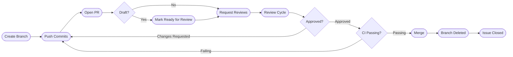

<div align="center">

# 02 · GitHub Collaboration

### Issues · Pull Requests · Code Review · Projects · Branch Protection

[](./01-fundamentals.md)
[](./03-actions.md)

</div>

---

## Table of Contents

1. [Issues — Structured Problem Tracking](#1-issues)
2. [Pull Requests — The Heart of Collaboration](#2-pull-requests)
3. [Code Review — Best Practices](#3-code-review)
4. [CODEOWNERS — Automatic Review Assignment](#4-codeowners)
5. [Branch Protection Rules](#5-branch-protection)
6. [GitHub Projects v2](#6-github-projects)
7. [GitHub Discussions](#7-discussions)
8. [Repository Templates and Files](#8-repo-templates)

---

## 1. Issues

Issues are GitHub's unified tracker for bugs, feature requests, tasks, and questions.

### Anatomy of a Good Issue

```markdown
## Description
Brief, one-paragraph summary of the problem or request.

## Steps to Reproduce  (for bugs)
1. Navigate to `/settings/security`
2. Click "Enable 2FA"
3. Observe: error 500 is returned

## Expected Behavior
The 2FA setup wizard should open.

## Actual Behavior
HTTP 500 with body: `{"error": "auth_service_unavailable"}`

## Environment
- OS: Ubuntu 22.04
- Browser: Chrome 120
- Version: v2.3.1

## Logs / Screenshots
<details>
<summary>Server logs</summary>

```
[ERROR] 2025-01-15T14:23:11Z auth_service: connection refused :8081
```

</details>
```

### Issue Labels System

> **Tip:** A well-designed label taxonomy makes filtering and triage dramatically faster. Use a consistent color scheme.

**Recommended label schema:**

| Category | Example Labels | Color Family |
|----------|----------------|:------------:|
| **Type** | `bug` · `feature` · `docs` · `chore` | Hues |
| **Priority** | `priority:critical` · `priority:high` · `priority:low` | Reds → yellows |
| **Status** | `status:needs-triage` · `status:blocked` · `status:in-progress` | Blues |
| **Area** | `area:auth` · `area:api` · `area:frontend` | Greens |
| **Effort** | `effort:xs` · `effort:s` · `effort:m` · `effort:l` | Purples |
| **Special** | `good first issue` · `help wanted` · `wontfix` | Standard |

```bash
# Create labels via CLI
gh label create "priority:critical" --color "d73a4a" --description "Blocks release or production"
gh label create "area:auth" --color "0075ca" --description "Authentication & authorization"

# List labels
gh label list

# Clone labels from another repo
gh label clone owner/source-repo
```

### Issue Templates

Create `.github/ISSUE_TEMPLATE/` with template files:

```
.github/
├── ISSUE_TEMPLATE/
│   ├── config.yml          ← Controls the template picker
│   ├── bug_report.yml      ← Structured form (YAML)
│   └── feature_request.md  ← Markdown template
```

**`config.yml`** — locks template chooser and adds external links:

```yaml
blank_issues_enabled: false
contact_links:
  - name: Security Vulnerability
    url: https://example.com/security
    about: Do NOT open a public issue for security bugs
  - name: Stack Overflow
    url: https://stackoverflow.com/questions/tagged/myproject
    about: Ask usage questions here
```

**`bug_report.yml`** — structured form (preferred over Markdown templates):

```yaml
name: Bug Report
description: Report a reproducible bug
labels: ["bug", "status:needs-triage"]
assignees: []
body:
  - type: markdown
    attributes:
      value: |
        Thanks for reporting! Please fill this out completely.

  - type: textarea
    id: description
    attributes:
      label: What happened?
      placeholder: Describe the bug clearly.
    validations:
      required: true

  - type: textarea
    id: reproduction
    attributes:
      label: Steps to reproduce
      value: |
        1.
        2.
        3.
    validations:
      required: true

  - type: dropdown
    id: priority
    attributes:
      label: Severity
      options:
        - Low — minor inconvenience
        - Medium — functionality impaired
        - High — major feature broken
        - Critical — data loss or security issue
    validations:
      required: true

  - type: input
    id: version
    attributes:
      label: Version
      placeholder: e.g. v2.3.1
    validations:
      required: true

  - type: checkboxes
    id: checklist
    attributes:
      label: Pre-submission checklist
      options:
        - label: I searched existing issues and this isn't a duplicate
          required: true
        - label: I can consistently reproduce this
          required: false
```

### Closing Issues via Commits and PRs

GitHub automatically closes issues when merged to the default branch:

```
# In commit message or PR body:
Fixes #42
Closes #42
Resolves #42

# Close multiple:
Fixes #42, #77

# Cross-repo:
Fixes owner/repo#42
```

### Milestones

Milestones group issues/PRs toward a goal with a due date:

```bash
# Create milestone
gh api repos/{owner}/{repo}/milestones \
  --method POST \
  --field title="v2.0.0" \
  --field due_on="2025-03-01T00:00:00Z" \
  --field description="Major release with OAuth2 and GraphQL API"

# List open milestones
gh api repos/{owner}/{repo}/milestones --jq '.[].title'
```

---

## 2. Pull Requests

A pull request is a **request to merge one branch into another**, with attached discussion, review, and CI.

### PR Lifecycle



### Creating a High-Quality PR

**Title format (Conventional Commits):**
```
feat(auth): add OAuth2 authorization code flow (#142)
fix(api): prevent null pointer in user service (#201)
```

**PR body template (`.github/PULL_REQUEST_TEMPLATE.md`):**

```markdown
## Summary
Brief description of WHAT changed and WHY.

## Changes
- [ ] Added `OAuthService` class with PKCE support
- [ ] Extended `UserModel` with `oauth_provider` field
- [ ] Added migration `20250115_add_oauth_fields`

## Type of Change
- [ ] Bug fix (non-breaking)
- [x] New feature (non-breaking)
- [ ] Breaking change
- [ ] Documentation

## Testing
- [ ] Unit tests added/updated
- [ ] Integration tests pass
- [ ] Manually tested (describe how)

## Screenshots (if UI change)
| Before | After |
|--------|-------|
|  |  |

## Related Issues
Closes #142
```

### Draft Pull Requests

```bash
# Create as draft (not ready for review)
gh pr create --draft --title "feat: OAuth2 [WIP]"

# Convert draft to ready for review
gh pr ready

# Or in web UI: "Ready for review" button
```

> **Tip:** Open PRs as drafts early in development. This gives teammates visibility into what you're working on and lets CI run before you're blocked by reviews.

### PR Review States

| State | Meaning | Blocks Merge? |
|-------|---------|:-------------:|
| **Comment** | Feedback only, no verdict | No |
| **Approve** | LGTM — ready to merge | No (enables it) |
| **Request Changes** | Must address before merging | Yes (if required) |
| **Dismiss review** | Admin can clear a blocking review | — |

### Auto-merge

```bash
# Enable auto-merge (merges when CI passes + approved)
gh pr merge --auto --squash

# Disable auto-merge
gh pr merge --disable-auto
```

---

## 3. Code Review

Code review is not just about finding bugs — it's about knowledge sharing, maintaining quality, and collective ownership.

### Reviewing Effectively

**As a reviewer:**

```markdown
# Neutral / informational
nit: This could be simplified to a one-liner.
q: Why did we choose HashMap here over TreeMap?

# Suggestive (non-blocking)
Consider extracting this into a helper — it's used in 3 places already.

# Blocking
This SQL query is vulnerable to injection. User input must be parameterized.
```

> **Tip:** Use the **prefix convention**: `nit:`, `q:`, `blocking:`, `idea:`. Reviewers know the weight of each comment instantly.

### Suggesting Changes

In the GitHub UI, reviewers can propose exact code changes:

````markdown
```suggestion
const userId = req.user?.id ?? null;
```
````

The author can accept the suggestion in one click, which creates a commit authored by the reviewer — great for small fixes.

### Review via CLI

```bash
# View PR diff in terminal
gh pr diff 42

# Checkout PR locally (read-only review)
gh pr checkout 42

# Submit a review
gh pr review 42 --approve --body "LGTM — great work on the token handling."
gh pr review 42 --request-changes --body "See inline comments."
gh pr review 42 --comment --body "Left some suggestions."
```

### Review Checklist (Mental Model)

Work through these layers in order:

```
Layer 1: Architecture & Design
  □ Does this solve the right problem?
  □ Is the abstraction level appropriate?
  □ Will this be maintainable in 6 months?

Layer 2: Correctness
  □ Does it handle edge cases (null, empty, overflow)?
  □ Are error paths handled?
  □ Any race conditions or concurrency issues?

Layer 3: Security
  □ Input validation at boundaries?
  □ Authorization checks present?
  □ No secrets, PII, or credentials in code?

Layer 4: Performance
  □ Any N+1 queries?
  □ Appropriate caching?
  □ Will this scale?

Layer 5: Tests
  □ Critical paths covered?
  □ Tests test behavior, not implementation?

Layer 6: Style (last, least important)
  □ Consistent with codebase conventions?
  □ Meaningful variable names?
```

---

## 4. CODEOWNERS

`CODEOWNERS` automatically assigns reviewers when files they own are modified.

**Location options:**
- `.github/CODEOWNERS`
- `docs/CODEOWNERS`
- `CODEOWNERS` (repo root)

### Syntax

```
# Pattern                        Owner(s)
# ─────────────────────────────────────────────────────────

# Default owner for everything not matched below
*                               @myorg/core-team

# Auth subsystem — needs security team
src/auth/                       @myorg/security-team @alice

# Infrastructure configs — needs DevOps
*.tf                            @bob @myorg/devops
*.yml                           @myorg/devops
.github/workflows/              @myorg/devops

# Frontend — owned by UI team
src/frontend/                   @myorg/ui-team
src/components/                 @myorg/ui-team

# Docs can be reviewed by anyone on writing team
docs/                           @myorg/writers

# Specific files
package.json                    @alice @bob
package-lock.json               @alice @bob
.env.example                    @myorg/security-team

# Glob patterns
src/**/*.test.ts                @myorg/qa-team
```

### Rules

1. **Last match wins** — more specific patterns at the bottom override general ones
2. Owners must have **write access** to the repository
3. If the PR author is a CODEOWNER, GitHub still assigns them but may not require their own review
4. Enable **"Require review from Code Owners"** in branch protection to enforce it

---

## 5. Branch Protection Rules

Branch protection prevents direct pushes, enforces CI, and requires reviews.

**Navigate:** Repository → Settings → Branches → Add rule

### Common Configuration

```yaml
# Conceptual representation of branch protection settings
branch_name_pattern: "main"

require_pull_request_before_merging:
  required_approving_review_count: 2
  dismiss_stale_reviews_on_push: true
  require_review_from_code_owners: true
  restrict_dismissals_to: ["@org/leads"]

require_status_checks:
  strict: true  # Branch must be up to date before merging
  required_checks:
    - "ci/tests"
    - "ci/lint"
    - "security/scan"

require_signed_commits: true
require_linear_history: true  # Disables merge commits; forces squash/rebase

restrict_pushes:
  allow_force_pushes: false
  allow_deletions: false
  restrict_to: []  # Nobody can push directly
```

### Via GitHub CLI / API

```bash
# Set branch protection (requires admin)
gh api repos/{owner}/{repo}/branches/main/protection \
  --method PUT \
  --field required_status_checks='{"strict":true,"contexts":["ci/tests"]}' \
  --field enforce_admins=true \
  --field required_pull_request_reviews='{"required_approving_review_count":2}' \
  --field restrictions=null

# Check current protection
gh api repos/{owner}/{repo}/branches/main/protection
```

### Ruleset (New Model, GitHub Enterprise and some plans)

Rulesets are the next-generation replacement for branch protection, offering:
- Target multiple branches with one rule
- Import/export as JSON
- Bypass lists (not just bypass for admins)
- Evaluation mode (dry run before enforcement)

---

## 6. GitHub Projects v2

GitHub Projects v2 is a **flexible spreadsheet/kanban/roadmap** tool built on top of issues and PRs.

### Views Available

| View | Best For |
|------|---------|
| **Board** | Kanban-style sprint tracking |
| **Table** | Bulk editing, sorting, custom fields |
| **Roadmap** | Timeline/Gantt for release planning |

### Custom Fields

| Field Type | Use Case |
|------------|---------|
| Text | Notes, external ticket IDs |
| Number | Story points, priority score |
| Date | Target date, due date |
| Single select | Status, priority, team |
| Iteration | Sprint management |

### Workflows (Automation)

Built-in automations (no Actions needed):

```
When: Item added to project        → Set Status: Todo
When: Item closed                  → Set Status: Done
When: PR merged                    → Set Status: Done
When: PR review requested          → Set Status: In Review
```

### Project via CLI

```bash
# List projects
gh project list --owner myorg

# View project items
gh project item-list 1 --owner myorg --format json

# Add an issue to a project
gh project item-add 1 --owner myorg --url https://github.com/myorg/repo/issues/42
```

---

## 7. GitHub Discussions

Discussions are threaded, categorized conversations — less structured than Issues but perfect for Q&A, announcements, and RFCs.

### Category Types

| Category Type | Usage |
|---------------|-------|
| **General** | Open-ended conversation |
| **Idea** | Feature proposals before Issues |
| **Q&A** | Question + marked answer (Stack Overflow-style) |
| **Show and Tell** | Share projects, demos |
| **Announcement** | Admin-only posting |
| **Poll** | Vote on options |

### When to Use Discussions vs Issues

```
Discussion: "Should we migrate from REST to GraphQL?"
Issue:      "GraphQL endpoint returns 500 for nested queries"

Discussion: "How do I configure custom headers?"
Issue:      "Custom headers are silently dropped (bug)"

Discussion: "RFC: New authentication architecture"
Issue:      "Implement OAuth2 per RFC #234"
```

> **Tip:** Use Discussions for questions and open-ended topics. Convert to an Issue when the scope and solution become clear.

---

## 8. Repository Templates and Files

### Special GitHub Files

```
.github/
├── ISSUE_TEMPLATE/           ← Issue templates
├── PULL_REQUEST_TEMPLATE.md  ← Default PR body
├── CODEOWNERS               ← Auto-assign reviewers
├── FUNDING.yml              ← Sponsor button
├── workflows/               ← GitHub Actions
├── SECURITY.md              ← Security policy
└── dependabot.yml           ← Dependabot config

Root-level special files:
├── README.md                ← Repo landing page
├── LICENSE                  ← License
├── CONTRIBUTING.md          ← Contribution guide
├── CODE_OF_CONDUCT.md       ← Community standards
└── CHANGELOG.md             ← Release history
```

### `CONTRIBUTING.md` Essentials

```markdown
# Contributing

## Development Setup
```bash
git clone https://github.com/org/repo.git
cd repo
npm install
cp .env.example .env
npm run dev
```

## Submitting a PR
1. Fork the repo
2. Create a branch: `git switch -c feat/your-feature`
3. Make changes and add tests
4. Push and open a PR against `main`

## Commit Convention
We follow [Conventional Commits](https://conventionalcommits.org).

## Code Style
Run `npm run lint` before pushing. CI will fail on lint errors.
```

### Repository Templates

Convert any repo to a template (Settings → General → Template repository). When used:
- All files and directories are copied
- Git history is **not** copied (fresh start)
- Branch protection, secrets, etc. are **not** copied (must configure separately)

```bash
# Create a repo from a template
gh repo create myorg/new-service \
  --template myorg/service-template \
  --private \
  --clone
```

<details>
<summary><strong>Automation: Sync labels across repos with GitHub CLI</strong></summary>

```bash
#!/bin/bash
# sync-labels.sh — Copy labels from a source repo to all repos in an org

SOURCE_REPO="myorg/label-source"
ORG="myorg"

# Get all repos in org
REPOS=$(gh repo list "$ORG" --json nameWithOwner --jq '.[].nameWithOwner' --limit 100)

for REPO in $REPOS; do
  echo "Syncing labels to $REPO..."
  gh label clone "$SOURCE_REPO" --repo "$REPO" --force
done
```

</details>

---

**← Previous:** [01 · Fundamentals](./01-fundamentals.md) &nbsp;&nbsp;&nbsp; **Next →** [03 · GitHub Actions](./03-actions.md)
