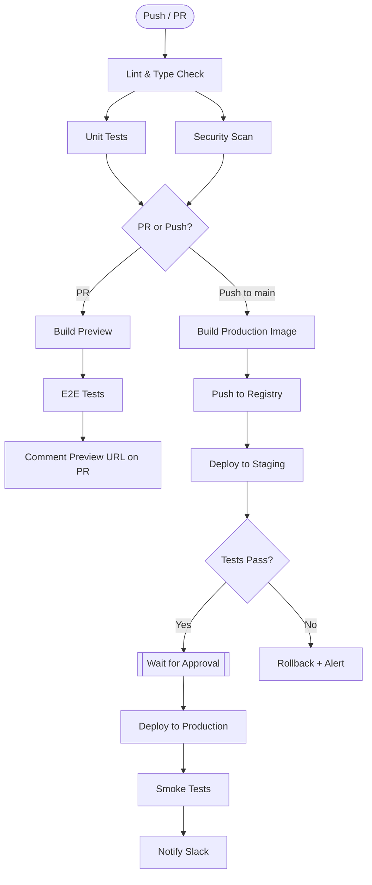

<div align="center">

# 03 · GitHub Actions

### Automate Everything — CI/CD, Testing, Deployments, and Custom Workflows

[](./02-collaboration.md)
[](./04-advanced.md)
[](https://docs.github.com/en/actions)

</div>

---

## Table of Contents

1. [Core Concepts](#1-core-concepts)
2. [Workflow Anatomy](#2-workflow-anatomy)
3. [Event Triggers](#3-event-triggers)
4. [Jobs and Steps](#4-jobs-and-steps)
5. [Expressions and Contexts](#5-expressions-and-contexts)
6. [Matrix Builds](#6-matrix-builds)
7. [Secrets and Environments](#7-secrets-and-environments)
8. [Caching and Artifacts](#8-caching-and-artifacts)
9. [Reusable Workflows](#9-reusable-workflows)
10. [Custom Actions](#10-custom-actions)
11. [Real-World Patterns](#11-real-world-patterns)

---

## 1. Core Concepts

```
GitHub Actions Hierarchy

Organization / Repository
└── .github/workflows/
    └── ci.yml                   ← Workflow (a YAML file)
        ├── on: [push, pull_request]  ← Trigger(s)
        └── jobs:
            ├── test:            ← Job (runs on one runner)
            │   ├── runs-on: ubuntu-latest
            │   └── steps:
            │       ├── uses: actions/checkout@v4   ← Action (reusable unit)
            │       └── run: npm test               ← Shell command
            └── deploy:          ← Job (can depend on test)
                └── needs: [test]
```

| Term | Definition |
|------|------------|
| **Workflow** | A YAML file in `.github/workflows/`. Triggered by events. |
| **Event** | Something that triggers a workflow (`push`, `pull_request`, `schedule`, etc.) |
| **Job** | A set of steps that run on the same runner. Jobs run in parallel by default. |
| **Step** | A single task — either a `run:` command or a `uses:` action reference |
| **Action** | A reusable, packaged step from the marketplace or your repo |
| **Runner** | The virtual machine (or self-hosted machine) that executes a job |
| **Artifact** | Files produced by a workflow, uploaded for use across jobs or download |
| **Cache** | Saved dependencies that speed up future workflow runs |
| **Secret** | Encrypted value injected as an environment variable |
| **Environment** | Named deployment target with protection rules and its own secrets |

---

## 2. Workflow Anatomy

```yaml
# .github/workflows/ci.yml
name: CI

# ─── TRIGGERS ──────────────────────────────────────────────────────────────────
on:
  push:
    branches: [main, "release/**"]
    paths-ignore: ["docs/**", "*.md"]
  pull_request:
    branches: [main]
  workflow_dispatch:            # Manual trigger (adds "Run workflow" button)
    inputs:
      environment:
        description: Target environment
        required: true
        default: staging
        type: choice
        options: [staging, production]

# ─── CONCURRENCY ────────────────────────────────────────────────────────────────
concurrency:
  group: ${{ github.workflow }}-${{ github.ref }}
  cancel-in-progress: true     # Cancel older runs on new pushes to same branch

# ─── PERMISSIONS ────────────────────────────────────────────────────────────────
permissions:
  contents: read
  pull-requests: write
  packages: write

# ─── ENVIRONMENT VARIABLES ──────────────────────────────────────────────────────
env:
  NODE_VERSION: "20"
  REGISTRY: ghcr.io

# ─── JOBS ───────────────────────────────────────────────────────────────────────
jobs:
  test:
    name: Test (${{ matrix.os }})
    runs-on: ${{ matrix.os }}
    timeout-minutes: 30

    strategy:
      fail-fast: false
      matrix:
        os: [ubuntu-latest, windows-latest]
        node: ["18", "20"]

    steps:
      - name: Checkout
        uses: actions/checkout@v4

      - name: Setup Node.js
        uses: actions/setup-node@v4
        with:
          node-version: ${{ matrix.node }}
          cache: npm

      - name: Install dependencies
        run: npm ci

      - name: Run tests
        run: npm test -- --reporter=junit --output-file=results.xml

      - name: Upload test results
        uses: actions/upload-artifact@v4
        if: always()           # Upload even if tests fail
        with:
          name: test-results-${{ matrix.os }}-node${{ matrix.node }}
          path: results.xml
          retention-days: 7

  deploy:
    name: Deploy to ${{ inputs.environment || 'staging' }}
    needs: [test]
    runs-on: ubuntu-latest
    environment:
      name: ${{ inputs.environment || 'staging' }}
      url: https://${{ inputs.environment || 'staging' }}.example.com
    if: github.ref == 'refs/heads/main'

    steps:
      - name: Checkout
        uses: actions/checkout@v4

      - name: Deploy
        run: ./scripts/deploy.sh
        env:
          DEPLOY_KEY: ${{ secrets.DEPLOY_KEY }}
```

---

## 3. Event Triggers

### Complete Trigger Reference

<details>
<summary><strong>Code-related events</strong></summary>

```yaml
on:
  push:
    branches: [main, "release/**"]
    branches-ignore: ["dependabot/**"]
    tags: ["v*"]
    paths: ["src/**", "package.json"]
    paths-ignore: ["**.md"]

  pull_request:
    types: [opened, synchronize, reopened, labeled, unlabeled, closed]
    branches: [main]

  pull_request_review:
    types: [submitted, dismissed]

  pull_request_review_comment:
    types: [created, edited]

  create:    # branch or tag created
  delete:    # branch or tag deleted

  push:
    tags:
      - "v[0-9]+.[0-9]+.[0-9]+"   # Regex for semantic version tags
```

</details>

<details>
<summary><strong>Issue and discussion events</strong></summary>

```yaml
on:
  issues:
    types: [opened, labeled, assigned, closed]

  issue_comment:
    types: [created]             # Triggered on both Issue and PR comments

  discussion:
    types: [created, answered]

  discussion_comment:
    types: [created]
```

</details>

<details>
<summary><strong>Scheduled and manual triggers</strong></summary>

```yaml
on:
  schedule:
    - cron: "0 6 * * 1-5"      # 6AM UTC, Mon-Fri
    - cron: "0 0 * * 0"        # Midnight Sunday
  # Note: scheduled workflows only run on the default branch

  workflow_dispatch:
    inputs:
      version:
        description: "Release version (e.g. 1.2.3)"
        required: true
        type: string
      dry-run:
        description: "Run without side effects"
        required: false
        default: "false"
        type: boolean
      environment:
        type: choice
        options: [dev, staging, prod]
```

</details>

<details>
<summary><strong>Repository and workflow events</strong></summary>

```yaml
on:
  workflow_run:                  # Run after another workflow completes
    workflows: ["CI"]
    types: [completed]
    branches: [main]

  workflow_call:                 # Makes this a reusable workflow
    inputs:
      environment:
        type: string
        required: true
    secrets:
      DEPLOY_KEY:
        required: true

  repository_dispatch:           # Triggered by API call with custom event type
    types: [deploy-requested]

  release:
    types: [published, prereleased]

  registry_package:
    types: [published]
```

</details>

---

## 4. Jobs and Steps

### Job Configuration

```yaml
jobs:
  build:
    name: Build
    runs-on: ubuntu-latest

    # ── Dependencies ──────────────────────────────────────────────────────────
    needs: [lint, test]          # Run after these jobs complete

    # ── Conditions ────────────────────────────────────────────────────────────
    if: |
      github.event_name == 'push' &&
      github.ref == 'refs/heads/main' &&
      !contains(github.event.head_commit.message, '[skip ci]')

    # ── Outputs (pass data between jobs) ──────────────────────────────────────
    outputs:
      image-tag: ${{ steps.meta.outputs.tags }}
      version: ${{ steps.version.outputs.version }}

    # ── Runner (self-hosted example) ──────────────────────────────────────────
    runs-on:
      group: high-memory-runners
      labels: [self-hosted, linux, x64]

    # ── Services (sidecar containers) ─────────────────────────────────────────
    services:
      postgres:
        image: postgres:16
        env:
          POSTGRES_PASSWORD: postgres
          POSTGRES_DB: testdb
        ports:
          - 5432:5432
        options: >-
          --health-cmd pg_isready
          --health-interval 10s
          --health-timeout 5s
          --health-retries 5

      redis:
        image: redis:7-alpine
        ports:
          - 6379:6379
```

### Step Configuration

```yaml
steps:
  # ── Use an action ─────────────────────────────────────────────────────────
  - name: Checkout code
    uses: actions/checkout@v4
    with:
      fetch-depth: 0             # Full history for changelog generation
      token: ${{ secrets.GITHUB_TOKEN }}

  # ── Run a command ─────────────────────────────────────────────────────────
  - name: Build
    run: |
      echo "Building version $VERSION"
      make build
    env:
      VERSION: ${{ steps.version.outputs.version }}
      NODE_ENV: production

  # ── Conditional step ──────────────────────────────────────────────────────
  - name: Notify on failure
    if: failure()
    uses: slackapi/slack-github-action@v1
    with:
      channel-id: ${{ vars.SLACK_CHANNEL }}
      slack-message: "Build failed on ${{ github.ref }}"
    env:
      SLACK_BOT_TOKEN: ${{ secrets.SLACK_BOT_TOKEN }}

  # ── Set output for other steps/jobs ───────────────────────────────────────
  - name: Get version
    id: version
    run: |
      VERSION=$(cat package.json | jq -r .version)
      echo "version=$VERSION" >> $GITHUB_OUTPUT
      echo "tag=v$VERSION" >> $GITHUB_OUTPUT

  # ── Multi-line script ─────────────────────────────────────────────────────
  - name: Run integration tests
    run: |
      set -euo pipefail
      npm run db:migrate
      npm run test:integration -- --bail
    timeout-minutes: 15
    continue-on-error: false
```

### Job-Level Conditions Reference

| Expression | When it's true |
|------------|----------------|
| `success()` | All previous steps succeeded (default) |
| `failure()` | Any previous step failed |
| `always()` | Regardless of outcome |
| `cancelled()` | Workflow was cancelled |
| `!cancelled()` | Was not cancelled (includes failure) |
| `needs.test.result == 'success'` | Specific job succeeded |
| `github.event_name == 'push'` | Specific event |
| `startsWith(github.ref, 'refs/tags/')` | Running on a tag |
| `contains(github.event.pull_request.labels.*.name, 'deploy')` | PR has label |

---

## 5. Expressions and Contexts

### Context Objects

| Context | Contains | Example |
|---------|----------|---------|
| `github` | Event data, repo, actor, ref | `github.actor` |
| `env` | Workflow/job/step env vars | `env.NODE_VERSION` |
| `vars` | Repository/org variables | `vars.DEPLOY_TARGET` |
| `secrets` | Encrypted secrets | `secrets.API_KEY` |
| `steps` | Previous step outputs/results | `steps.build.outputs.image` |
| `jobs` | Current job's outputs | `jobs.build.outputs.tag` |
| `needs` | Needed jobs' outputs/results | `needs.test.result` |
| `inputs` | `workflow_dispatch` / `workflow_call` inputs | `inputs.version` |
| `matrix` | Current matrix combination values | `matrix.os` |
| `runner` | Runner metadata | `runner.os` |

### Expression Functions

```yaml
# String functions
${{ startsWith(github.ref, 'refs/tags/') }}
${{ endsWith(runner.os, 'Windows') }}
${{ contains(github.event.commits.*.message, 'hotfix') }}
${{ format('Hello {0}!', github.actor) }}

# Object/array functions
${{ toJSON(matrix) }}
${{ fromJSON(steps.data.outputs.json).key }}
${{ join(matrix.include.*.os, ', ') }}

# Conditionals (ternary via && ||)
${{ github.event_name == 'push' && 'pushed' || 'other' }}

# hashFiles — for cache keys
${{ hashFiles('**/package-lock.json') }}
${{ hashFiles('**/*.tf') }}
```

### Writing to GITHUB_OUTPUT, GITHUB_ENV, GITHUB_STEP_SUMMARY

```bash
# Set step output (consumed by ${{ steps.id.outputs.key }})
echo "version=1.2.3" >> $GITHUB_OUTPUT
echo "multiline<<EOF" >> $GITHUB_OUTPUT
echo "line one" >> $GITHUB_OUTPUT
echo "line two" >> $GITHUB_OUTPUT
echo "EOF" >> $GITHUB_OUTPUT

# Set environment variable for subsequent steps in same job
echo "VERSION=1.2.3" >> $GITHUB_ENV
echo "NODE_OPTIONS=--max-old-space-size=4096" >> $GITHUB_ENV

# Write a markdown summary visible in the Actions UI
echo "## Test Results" >> $GITHUB_STEP_SUMMARY
echo "| Test | Status |" >> $GITHUB_STEP_SUMMARY
echo "|------|--------|" >> $GITHUB_STEP_SUMMARY
echo "| unit | ✅ Pass |" >> $GITHUB_STEP_SUMMARY
echo "| integration | ✅ Pass |" >> $GITHUB_STEP_SUMMARY

# Add to PATH for subsequent steps
echo "$HOME/.local/bin" >> $GITHUB_PATH
```

---

## 6. Matrix Builds

Matrix builds run the same job across multiple configurations in parallel.

### Basic Matrix

```yaml
jobs:
  test:
    runs-on: ${{ matrix.os }}
    strategy:
      fail-fast: false          # Don't cancel other matrix jobs if one fails
      max-parallel: 4           # Limit concurrent jobs

      matrix:
        os: [ubuntu-latest, macos-latest, windows-latest]
        node: ["18", "20", "22"]
        # → 9 total combinations
```

### Advanced Matrix with Include/Exclude

```yaml
strategy:
  matrix:
    os: [ubuntu-latest, windows-latest]
    node: ["18", "20"]
    include:
      # Add extra fields to existing combinations
      - os: ubuntu-latest
        node: "20"
        coverage: true           # Only collect coverage on this combination

      # Add entirely new combinations not in the cross-product
      - os: macos-latest
        node: "20"
        experimental: true

    exclude:
      # Remove specific combinations
      - os: windows-latest
        node: "18"

steps:
  - name: Run tests with coverage
    if: matrix.coverage == true
    run: npm run test:coverage

  - name: Run tests
    if: matrix.coverage != true
    run: npm test
```

### Dynamic Matrix (Generated at Runtime)

```yaml
jobs:
  discover:
    runs-on: ubuntu-latest
    outputs:
      matrix: ${{ steps.set-matrix.outputs.matrix }}
    steps:
      - uses: actions/checkout@v4
      - id: set-matrix
        run: |
          # Discover services from directory structure
          SERVICES=$(ls services/ | jq -R -s -c 'split("\n")[:-1]')
          echo "matrix={\"service\":$SERVICES}" >> $GITHUB_OUTPUT

  build:
    needs: discover
    runs-on: ubuntu-latest
    strategy:
      matrix: ${{ fromJSON(needs.discover.outputs.matrix) }}
    steps:
      - run: echo "Building ${{ matrix.service }}"
```

---

## 7. Secrets and Environments

### Secret Scopes

| Scope | Location | Accessible In |
|-------|----------|--------------|
| **Repository** | Repo → Settings → Secrets | That repo's workflows |
| **Environment** | Repo → Settings → Environments | Jobs targeting that environment |
| **Organization** | Org → Settings → Secrets | Selected repos within org |

### Using Secrets

```yaml
steps:
  - name: Deploy
    env:
      API_KEY: ${{ secrets.PRODUCTION_API_KEY }}
      DB_URL: ${{ secrets.DATABASE_URL }}
    run: ./deploy.sh

  - name: Configure AWS
    uses: aws-actions/configure-aws-credentials@v4
    with:
      aws-access-key-id: ${{ secrets.AWS_ACCESS_KEY_ID }}
      aws-secret-access-key: ${{ secrets.AWS_SECRET_ACCESS_KEY }}
      aws-region: us-east-1
```

> **Warning:** Secrets are redacted in logs, but never `echo $SECRET` — the value may appear in debug output. Use `${{ secrets.X }}` only in `env:` or `with:` blocks.

### Environments

Environments add **protection gates** to deployments:

```yaml
# .github/workflows/deploy.yml
jobs:
  deploy-staging:
    environment:
      name: staging
      url: https://staging.example.com
    # Runs immediately — no protection on staging

  deploy-production:
    needs: [deploy-staging]
    environment:
      name: production
      url: https://example.com
    # Waits for:
    # - Required reviewers to approve
    # - Branch pattern (only from main)
    # - Wait timer (e.g. 5 minutes to allow rollback decisions)
```

**Environment configuration (Settings → Environments):**

```
Production environment:
├── Required reviewers: @alice, @myorg/leads (1 required)
├── Prevent self-review: ✓
├── Wait timer: 5 minutes
├── Deployment branches: main only
└── Secrets:
    ├── PRODUCTION_DATABASE_URL
    └── PRODUCTION_API_KEY
```

### OIDC — Keyless Authentication (Best Practice)

Replace long-lived secrets with short-lived tokens:

```yaml
permissions:
  id-token: write
  contents: read

steps:
  - name: Configure AWS via OIDC
    uses: aws-actions/configure-aws-credentials@v4
    with:
      role-to-assume: arn:aws:iam::123456789:role/github-actions
      aws-region: us-east-1
      # No secrets needed — GitHub mints a JWT, AWS exchanges it for temp creds
```

---

## 8. Caching and Artifacts

### Dependency Caching

```yaml
# Option 1: Built into setup actions (simplest)
- uses: actions/setup-node@v4
  with:
    node-version: "20"
    cache: npm            # or: yarn, pnpm

- uses: actions/setup-python@v5
  with:
    python-version: "3.12"
    cache: pip

# Option 2: Manual cache (full control)
- name: Cache dependencies
  uses: actions/cache@v4
  id: cache
  with:
    path: |
      node_modules
      ~/.npm
    key: ${{ runner.os }}-node-${{ hashFiles('**/package-lock.json') }}
    restore-keys: |
      ${{ runner.os }}-node-

- name: Install (if cache miss)
  if: steps.cache.outputs.cache-hit != 'true'
  run: npm ci
```

### Cache Key Strategy

```yaml
# Good: Specific, deterministic key with fallback chain
key: ${{ runner.os }}-cargo-${{ hashFiles('**/Cargo.lock') }}
restore-keys: |
  ${{ runner.os }}-cargo-${{ hashFiles('**/Cargo.lock') }}
  ${{ runner.os }}-cargo-

# Bad: Too broad (never invalidates)
key: node-modules

# Bad: Too narrow (always misses)
key: ${{ github.sha }}-deps
```

### Artifacts

```yaml
# Upload
- name: Upload build
  uses: actions/upload-artifact@v4
  with:
    name: dist-${{ github.sha }}
    path: |
      dist/
      !dist/**/*.map     # Exclude source maps
    if-no-files-found: error
    retention-days: 30

# Download in another job
- name: Download build
  uses: actions/download-artifact@v4
  with:
    name: dist-${{ github.sha }}
    path: ./dist

# Download all artifacts (to separate directories by name)
- uses: actions/download-artifact@v4
  with:
    path: artifacts/
    merge-multiple: false
```

---

## 9. Reusable Workflows

Reusable workflows let you share entire workflow files across repositories.

### Defining a Reusable Workflow

```yaml
# .github/workflows/deploy-service.yml
name: Deploy Service (Reusable)

on:
  workflow_call:
    inputs:
      service-name:
        required: true
        type: string
      environment:
        required: true
        type: string
        default: staging
      image-tag:
        required: true
        type: string
    secrets:
      DEPLOY_KEY:
        required: true
      SLACK_WEBHOOK:
        required: false
    outputs:
      deployment-url:
        description: "The URL of the deployed service"
        value: ${{ jobs.deploy.outputs.url }}

jobs:
  deploy:
    runs-on: ubuntu-latest
    environment: ${{ inputs.environment }}
    outputs:
      url: ${{ steps.deploy.outputs.url }}
    steps:
      - name: Deploy ${{ inputs.service-name }}
        id: deploy
        run: |
          echo "Deploying ${{ inputs.service-name }}:${{ inputs.image-tag }} to ${{ inputs.environment }}"
          URL="https://${{ inputs.environment }}.example.com/${{ inputs.service-name }}"
          echo "url=$URL" >> $GITHUB_OUTPUT
        env:
          DEPLOY_KEY: ${{ secrets.DEPLOY_KEY }}
```

### Calling a Reusable Workflow

```yaml
# In any repo's workflow
jobs:
  deploy-api:
    uses: myorg/devops/.github/workflows/deploy-service.yml@main
    with:
      service-name: api
      environment: production
      image-tag: ${{ needs.build.outputs.image-tag }}
    secrets:
      DEPLOY_KEY: ${{ secrets.DEPLOY_KEY }}
      SLACK_WEBHOOK: ${{ secrets.SLACK_WEBHOOK }}

  # inherit: pass ALL caller secrets to reusable workflow
  deploy-web:
    uses: myorg/devops/.github/workflows/deploy-service.yml@main
    with:
      service-name: web
      environment: production
      image-tag: ${{ needs.build.outputs.image-tag }}
    secrets: inherit
```

---

## 10. Custom Actions

GitHub supports three action types. Choose based on your needs.

### Action Type Comparison

| Type | Language | Startup | Portability | Best For |
|------|----------|---------|-------------|---------|
| **Composite** | Shell/YAML | Instant | Any runner | Wrapping existing actions/scripts |
| **JavaScript** | Node.js | Fast (~1s) | Any runner | Complex logic, API calls |
| **Docker** | Any | Slow (~30s) | Linux only | Specific runtime requirements |

### Composite Action

```yaml
# actions/setup-project/action.yml
name: Setup Project
description: Install dependencies and configure environment
author: MyOrg

inputs:
  node-version:
    description: Node.js version to use
    required: false
    default: "20"
  install-playwright:
    description: Install Playwright browsers
    required: false
    default: "false"

outputs:
  cache-hit:
    description: Whether the cache was hit
    value: ${{ steps.cache.outputs.cache-hit }}

runs:
  using: composite
  steps:
    - uses: actions/setup-node@v4
      with:
        node-version: ${{ inputs.node-version }}
        cache: npm

    - name: Install dependencies
      shell: bash
      run: npm ci

    - name: Install Playwright
      if: inputs.install-playwright == 'true'
      shell: bash
      run: npx playwright install --with-deps chromium
```

**Usage:**
```yaml
- uses: ./.github/actions/setup-project    # local action
  with:
    node-version: "22"
    install-playwright: "true"

- uses: myorg/actions/setup-project@v2     # from another repo
```

### JavaScript Action

```yaml
# action.yml
name: Post PR Comment
description: Post or update a comment on a pull request
inputs:
  message:
    required: true
  token:
    required: true
    default: ${{ github.token }}
outputs:
  comment-id:
    description: ID of the created or updated comment

runs:
  using: node20
  main: dist/index.js
```

```typescript
// src/index.ts
import * as core from "@actions/core";
import * as github from "@actions/github";

async function run() {
  try {
    const message = core.getInput("message", { required: true });
    const token = core.getInput("token", { required: true });
    const octokit = github.getOctokit(token);
    const context = github.context;

    if (!context.payload.pull_request) {
      core.warning("Not a pull request — skipping comment");
      return;
    }

    const { data: comment } = await octokit.rest.issues.createComment({
      owner: context.repo.owner,
      repo: context.repo.repo,
      issue_number: context.payload.pull_request.number,
      body: message,
    });

    core.setOutput("comment-id", comment.id.toString());
    core.info(`Created comment #${comment.id}`);
  } catch (error) {
    core.setFailed(`Action failed: ${error}`);
  }
}

run();
```

---

## 11. Real-World Patterns

### Full CI/CD Pipeline



### Docker Build and Push to GHCR

```yaml
- name: Log in to GHCR
  uses: docker/login-action@v3
  with:
    registry: ghcr.io
    username: ${{ github.actor }}
    password: ${{ secrets.GITHUB_TOKEN }}

- name: Extract Docker metadata
  id: meta
  uses: docker/metadata-action@v5
  with:
    images: ghcr.io/${{ github.repository }}
    tags: |
      type=ref,event=branch
      type=ref,event=pr
      type=semver,pattern={{version}}
      type=semver,pattern={{major}}.{{minor}}
      type=sha,prefix=sha-

- name: Build and push
  uses: docker/build-push-action@v5
  with:
    context: .
    platforms: linux/amd64,linux/arm64
    push: ${{ github.event_name != 'pull_request' }}
    tags: ${{ steps.meta.outputs.tags }}
    labels: ${{ steps.meta.outputs.labels }}
    cache-from: type=gha
    cache-to: type=gha,mode=max
```

### Release Automation

```yaml
# Triggered when a tag v*.*.* is pushed
on:
  push:
    tags: ["v[0-9]+.[0-9]+.[0-9]+"]

jobs:
  release:
    runs-on: ubuntu-latest
    permissions:
      contents: write
    steps:
      - uses: actions/checkout@v4
        with:
          fetch-depth: 0

      - name: Generate changelog
        id: changelog
        run: |
          PREV_TAG=$(git describe --tags --abbrev=0 HEAD~1 2>/dev/null || echo "")
          if [ -n "$PREV_TAG" ]; then
            NOTES=$(git log $PREV_TAG..HEAD --oneline --pretty=format:"- %s (%h)")
          else
            NOTES=$(git log --oneline --pretty=format:"- %s (%h)")
          fi
          echo "notes<<EOF" >> $GITHUB_OUTPUT
          echo "$NOTES" >> $GITHUB_OUTPUT
          echo "EOF" >> $GITHUB_OUTPUT

      - name: Create GitHub Release
        uses: softprops/action-gh-release@v2
        with:
          body: |
            ## Changes in ${{ github.ref_name }}

            ${{ steps.changelog.outputs.notes }}
          files: |
            dist/*.tar.gz
            dist/*.zip
          make_latest: true
          generate_release_notes: false  # Use our custom notes
```

<details>
<summary><strong>Dependabot configuration</strong></summary>

```yaml
# .github/dependabot.yml
version: 2
updates:
  # npm packages
  - package-ecosystem: npm
    directory: /
    schedule:
      interval: weekly
      day: monday
      time: "09:00"
      timezone: "America/New_York"
    open-pull-requests-limit: 10
    labels: ["dependencies", "automated"]
    groups:
      eslint:
        patterns: ["eslint*", "@typescript-eslint/*"]
    ignore:
      - dependency-name: "express"
        update-types: ["version-update:semver-major"]

  # GitHub Actions
  - package-ecosystem: github-actions
    directory: /
    schedule:
      interval: weekly
    labels: ["dependencies", "github-actions"]

  # Docker base images
  - package-ecosystem: docker
    directory: /
    schedule:
      interval: monthly
```

</details>

---

**← Previous:** [02 · Collaboration](./02-collaboration.md) &nbsp;&nbsp;&nbsp; **Next →** [04 · Advanced Platform](./04-advanced.md)
