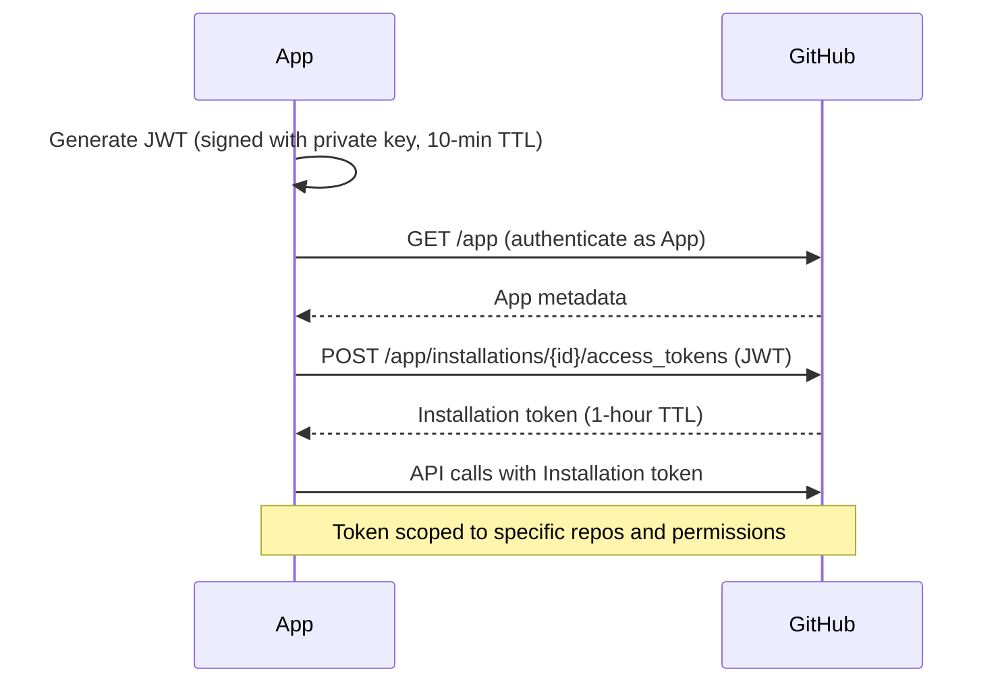

<div align="center">

# 04 · Advanced GitHub Platform

### CLI · REST API · GraphQL · Webhooks · Security · Packages · Pages

[](./03-actions.md)
[](./05-git-workflows.md)

</div>

---

## Table of Contents

1. [GitHub CLI (`gh`)](#1-github-cli)
2. [REST API](#2-rest-api)
3. [GraphQL API](#3-graphql-api)
4. [Webhooks](#4-webhooks)
5. [GitHub Apps vs OAuth Apps](#5-github-apps-vs-oauth-apps)
6. [Security Features](#6-security-features)
7. [GitHub Packages](#7-github-packages)
8. [GitHub Pages](#8-github-pages)

---

## 1. GitHub CLI

The `gh` CLI is the fastest way to interact with GitHub from the terminal. It understands your current repository context automatically.

### Authentication

```bash
# Interactive login
gh auth login

# Login with a token (for CI/scripting)
echo "$GITHUB_TOKEN" | gh auth login --with-token

# Login to GitHub Enterprise Server
gh auth login --hostname github.mycompany.com

# Check status
gh auth status

# Generate a token for scripts
gh auth token
```

### Pull Requests

```bash
# Create PR from current branch (--fill uses last commit message)
gh pr create --fill
gh pr create \
  --title "feat(auth): add OAuth2 flow" \
  --body-file .github/pr-body.md \
  --assignee @me \
  --reviewer alice,@myorg/backend \
  --label "feature,priority:high" \
  --milestone "v2.0" \
  --draft

# List PRs
gh pr list
gh pr list --state closed --author alice --limit 20
gh pr list --json number,title,state,author --jq '.[] | "\(.number) \(.title)"'

# View PR
gh pr view 42
gh pr view 42 --web           # Open in browser
gh pr view --json reviews,files,comments 42

# Review
gh pr review 42 --approve --body "Looks great!"
gh pr review 42 --request-changes --body "Please add tests"

# Merge
gh pr merge 42 --squash --delete-branch --auto

# Checkout a PR locally (for testing)
gh pr checkout 42

# Check CI status of a PR
gh pr checks 42

# Watch a running CI check
gh pr checks 42 --watch
```

### Issues

```bash
# Create
gh issue create \
  --title "Bug: login fails for SSO users" \
  --body-file issue-body.md \
  --label "bug,priority:critical" \
  --assignee @me

# List with filtering
gh issue list --label "priority:critical" --state open
gh issue list --milestone "v2.0" --assignee @me

# Close / reopen
gh issue close 77 --comment "Fixed in #89"
gh issue reopen 77

# Transfer to another repo
gh issue transfer 42 myorg/other-repo

# View all issues as JSON and process with jq
gh issue list --state open --json number,title,labels,assignees \
  --jq '.[] | select(.labels[].name == "bug")'
```

### Repository Management

```bash
# Create repo
gh repo create myorg/service-api \
  --private \
  --description "Core API service" \
  --homepage "https://api.example.com" \
  --add-readme \
  --gitignore Node \
  --license MIT \
  --clone

# Fork
gh repo fork upstream/repo --clone --remote --default-branch-only

# Clone with options
gh repo clone myorg/repo -- --depth 1 --branch main

# View repo info
gh repo view myorg/repo
gh repo view --json name,description,isPrivate,stargazerCount

# Archive / delete (destructive — will confirm)
gh repo archive myorg/old-service
gh repo delete myorg/test-repo --confirm

# Rename
gh api repos/myorg/old-name --method PATCH --field name=new-name

# List repos in org
gh repo list myorg --limit 100 --json name,isArchived --jq '.[] | select(.isArchived == false) | .name'
```

### Actions and Workflow Management

```bash
# List workflows
gh workflow list

# Run a workflow manually
gh workflow run deploy.yml \
  --field environment=production \
  --field version=2.0.1

# List runs
gh run list --workflow=ci.yml --limit 10
gh run list --status failure --json databaseId,name,conclusion

# View a run
gh run view 1234567890
gh run view 1234567890 --log                    # Full logs
gh run view 1234567890 --log-failed             # Only failed step logs

# Watch in real-time
gh run watch 1234567890

# Re-run
gh run rerun 1234567890
gh run rerun 1234567890 --failed               # Re-run only failed jobs

# Cancel
gh run cancel 1234567890

# Download artifacts from a run
gh run download 1234567890
gh run download 1234567890 --name dist-artifacts --dir ./artifacts
```

### Raw API Access

```bash
# GET request
gh api repos/{owner}/{repo}
gh api repos/{owner}/{repo}/releases/latest --jq '.tag_name'

# POST / PATCH / DELETE
gh api repos/{owner}/{repo}/labels \
  --method POST \
  --field name="priority:critical" \
  --field color="d73a4a"

# Pagination (automatic with --paginate)
gh api repos/{owner}/{repo}/issues \
  --paginate \
  --jq '.[].number'

# GraphQL
gh api graphql \
  --field query='query { viewer { login name } }' \
  --jq '.data.viewer'
```

---

## 2. REST API

GitHub's REST API provides programmatic access to everything on the platform.

### Authentication

```bash
# Personal Access Token (classic)
curl -H "Authorization: token ghp_yourtoken" https://api.github.com/user

# Fine-grained PAT
curl -H "Authorization: Bearer github_pat_..." https://api.github.com/user

# GitHub Actions (built-in)
curl -H "Authorization: token ${{ secrets.GITHUB_TOKEN }}" \
     https://api.github.com/repos/${{ github.repository }}/releases
```

### Common Endpoints

| Resource | Endpoint | Method |
|----------|----------|--------|
| Get repo | `/repos/{owner}/{repo}` | GET |
| List issues | `/repos/{owner}/{repo}/issues` | GET |
| Create issue | `/repos/{owner}/{repo}/issues` | POST |
| List PRs | `/repos/{owner}/{repo}/pulls` | GET |
| Get PR | `/repos/{owner}/{repo}/pulls/{number}` | GET |
| Merge PR | `/repos/{owner}/{repo}/pulls/{number}/merge` | PUT |
| List releases | `/repos/{owner}/{repo}/releases` | GET |
| Create release | `/repos/{owner}/{repo}/releases` | POST |
| Get user | `/users/{username}` | GET |
| List org repos | `/orgs/{org}/repos` | GET |
| List workflows | `/repos/{owner}/{repo}/actions/workflows` | GET |
| Trigger workflow | `/repos/{owner}/{repo}/actions/workflows/{id}/dispatches` | POST |

### Pagination

The API returns paginated results via `Link` headers:

```bash
# Request a page
curl "https://api.github.com/repos/org/repo/issues?per_page=100&page=2" \
  -H "Authorization: token $TOKEN"

# Response headers:
# Link: <...?page=1>; rel="prev", <...?page=3>; rel="next", <...?page=10>; rel="last"

# With gh CLI (handles pagination automatically)
gh api /repos/org/repo/issues --paginate --jq '.[].number'
```

### Rate Limits

| Auth Type | Limit | Reset |
|-----------|-------|-------|
| Unauthenticated | 60 req/hour | Hourly |
| Authenticated (PAT) | 5,000 req/hour | Hourly |
| GitHub Actions | 1,000 req/hour per repo | Hourly |
| GitHub App | 5,000–15,000 req/hour | Hourly |

```bash
# Check your current rate limit
curl -H "Authorization: token $TOKEN" https://api.github.com/rate_limit
```

### Practical Script: Close Stale Issues

```bash
#!/usr/bin/env bash
# Close issues with "stale" label and no activity in 30 days
set -euo pipefail

REPO="myorg/myrepo"
CUTOFF=$(date -d "30 days ago" --iso-8601)

gh issue list \
  --repo "$REPO" \
  --label stale \
  --state open \
  --json number,updatedAt \
  --jq ".[] | select(.updatedAt < \"$CUTOFF\") | .number" | \
while read -r issue_number; do
  echo "Closing stale issue #$issue_number"
  gh issue close "$issue_number" \
    --repo "$REPO" \
    --comment "Closing due to inactivity. Reopen if still relevant."
done
```

---

## 3. GraphQL API

GitHub's GraphQL API lets you retrieve exactly the data you need in a single request — no over-fetching.

### Why GraphQL Over REST?

| | REST | GraphQL |
|-|------|---------|
| Fetch PR with reviewers, labels, and linked issues | 4 requests | 1 request |
| Specify exact fields | No (get everything) | Yes |
| Nested relationships | Multiple round trips | Single query |
| Mutations | Multiple endpoints | Single `mutation` type |
| Cost/rate limits | Per-request | Per-point (complexity-based) |

### Querying

```graphql
# Fetch PR details with reviews and labels
query GetPullRequest($owner: String!, $repo: String!, $number: Int!) {
  repository(owner: $owner, name: $repo) {
    pullRequest(number: $number) {
      title
      bodyText
      state
      mergeable
      author {
        login
        avatarUrl
      }
      labels(first: 10) {
        nodes {
          name
          color
        }
      }
      reviews(first: 20) {
        nodes {
          author { login }
          state
          submittedAt
        }
      }
      commits(last: 5) {
        nodes {
          commit {
            messageHeadline
            statusCheckRollup {
              state
            }
          }
        }
      }
    }
  }
}
```

```bash
# Execute via gh CLI
gh api graphql \
  --field query='...' \
  --field owner=myorg \
  --field repo=myrepo \
  --field number=42
```

### Mutations

```graphql
# Add a label to an issue
mutation AddLabel($issueId: ID!, $labelId: ID!) {
  addLabelsToLabelable(input: {
    labelableId: $issueId
    labelIds: [$labelId]
  }) {
    labelable {
      ... on Issue {
        number
        labels(first: 5) {
          nodes { name }
        }
      }
    }
  }
}
```

### Pagination in GraphQL

```graphql
query ListIssues($owner: String!, $repo: String!, $after: String) {
  repository(owner: $owner, name: $repo) {
    issues(first: 100, after: $after, states: [OPEN]) {
      pageInfo {
        hasNextPage
        endCursor
      }
      nodes {
        number
        title
        createdAt
        labels(first: 5) {
          nodes { name }
        }
      }
    }
  }
}
```

### Rate Limiting in GraphQL

GraphQL uses a **point system** based on query complexity, not request count:

```graphql
# Check your rate limit
query {
  rateLimit {
    limit          # 5000 points/hour
    remaining
    resetAt
    cost           # Cost of THIS query
    nodeCount      # Nodes returned
  }
}
```

---

## 4. Webhooks

Webhooks let GitHub notify your server in real-time when events occur.

### Webhook vs Polling

| | Webhook | Polling |
|-|---------|---------|
| Delivery | Push (GitHub → you) | Pull (you → GitHub) |
| Latency | Near-instant | Up to interval delay |
| Rate limit impact | None | Yes |
| Infrastructure | Needs public endpoint | Works anywhere |
| Reliability | Retry on failure | You control |

### Creating a Webhook

```bash
# Create via API
curl https://api.github.com/repos/myorg/repo/hooks \
  -H "Authorization: token $TOKEN" \
  -d '{
    "name": "web",
    "active": true,
    "events": ["push", "pull_request", "issues"],
    "config": {
      "url": "https://hooks.example.com/github",
      "content_type": "json",
      "secret": "your-webhook-secret",
      "insecure_ssl": "0"
    }
  }'
```

### Verifying Webhook Signatures

Always verify the `X-Hub-Signature-256` header to ensure the payload came from GitHub:

```typescript
import crypto from "crypto";
import type { IncomingMessage, ServerResponse } from "http";

function verifySignature(
  payload: Buffer,
  signature: string,
  secret: string
): boolean {
  const expected = `sha256=${crypto
    .createHmac("sha256", secret)
    .update(payload)
    .digest("hex")}`;
  return crypto.timingSafeEqual(
    Buffer.from(signature),
    Buffer.from(expected)
  );
}

async function handleWebhook(req: IncomingMessage, res: ServerResponse) {
  const chunks: Buffer[] = [];
  for await (const chunk of req) chunks.push(chunk);
  const body = Buffer.concat(chunks);

  const sig = req.headers["x-hub-signature-256"] as string;
  if (!sig || !verifySignature(body, sig, process.env.WEBHOOK_SECRET!)) {
    res.writeHead(401).end("Unauthorized");
    return;
  }

  const event = req.headers["x-github-event"] as string;
  const payload = JSON.parse(body.toString());

  switch (event) {
    case "push":
      await handlePush(payload);
      break;
    case "pull_request":
      await handlePR(payload);
      break;
  }

  res.writeHead(200).end("ok");
}
```

### Webhook Events Reference

| Event | Fired When |
|-------|-----------|
| `push` | Commits pushed to a branch or tag |
| `pull_request` | PR opened, closed, synchronized, labeled, etc. |
| `pull_request_review` | Review submitted |
| `issues` | Issue opened, closed, labeled, assigned |
| `issue_comment` | Comment on issue or PR |
| `create` | Branch or tag created |
| `delete` | Branch or tag deleted |
| `release` | Release published, edited, deleted |
| `workflow_run` | Actions workflow completed |
| `check_run` | CI check run created/completed |
| `deployment` | Deployment created |
| `repository` | Repo settings changed, made public/private |
| `member` | Collaborator added/removed |
| `organization` | Org member added/removed |

### Development: Testing Webhooks Locally

```bash
# Use smee.io proxy to forward GitHub webhooks to localhost
npm install -g smee-client
smee --url https://smee.io/yourchannelid --target http://localhost:3000/webhooks

# Or use the GitHub CLI's built-in webhook forwarding (GitHub Enterprise)
gh webhook forward --repo=myorg/repo --events=push --url http://localhost:3000/hooks
```

---

## 5. GitHub Apps vs OAuth Apps

| | OAuth App | GitHub App |
|-|-----------|------------|
| **Acts as** | The user | A bot/machine identity |
| **Rate limits** | User's 5k/hour | 15k/hour + 1k/hour per install |
| **Permissions** | Broad scopes (repo, org) | Fine-grained per-resource |
| **Install scope** | User authorizes | User installs on repo/org |
| **Token type** | User token | Installation token (1-hour expiry) |
| **Best for** | User-facing integrations | Automation bots, CI tools |

### GitHub App Authentication Flow



```typescript
import jwt from "@octokit/auth-app";
import { Octokit } from "@octokit/rest";

const auth = createAppAuth({
  appId: process.env.APP_ID!,
  privateKey: process.env.PRIVATE_KEY!,
  installationId: process.env.INSTALLATION_ID!,
});

const { token } = await auth({ type: "installation" });
const octokit = new Octokit({ auth: token });
```

---

## 6. Security Features

### Secret Scanning

GitHub automatically scans all pushes for known secret patterns (API keys, tokens, etc.) from 100+ providers.

```yaml
# .github/secret_scanning.yml
paths-ignore:
  - "tests/fixtures/**"
  - "docs/examples/**"

# Custom patterns (GitHub Enterprise)
custom_patterns:
  - name: internal-api-key
    regex: "MYAPP_[A-Z0-9]{32}"
    secret_type: myapp_api_key
    keywords:
      - MYAPP_
```

### Code Scanning (CodeQL)

```yaml
# .github/workflows/codeql.yml
name: CodeQL Analysis
on:
  push:
    branches: [main]
  pull_request:
    branches: [main]
  schedule:
    - cron: "0 6 * * 1"   # Weekly on Monday

jobs:
  analyze:
    runs-on: ubuntu-latest
    permissions:
      security-events: write
      contents: read

    strategy:
      matrix:
        language: [javascript, python, go]

    steps:
      - uses: actions/checkout@v4

      - name: Initialize CodeQL
        uses: github/codeql-action/init@v3
        with:
          languages: ${{ matrix.language }}
          queries: security-extended    # More queries than default

      - name: Auto-build
        uses: github/codeql-action/autobuild@v3

      - name: Perform analysis
        uses: github/codeql-action/analyze@v3
        with:
          category: "/language:${{ matrix.language }}"
```

### Dependabot Alerts and Auto-Fix

```yaml
# .github/dependabot.yml
version: 2
updates:
  - package-ecosystem: npm
    directory: /
    schedule:
      interval: daily
    open-pull-requests-limit: 20
    assignees: [alice]
    reviewers: [bob]
    labels: [dependencies]
    commit-message:
      prefix: "chore(deps)"
    groups:
      dev-tools:
        dependency-type: development
        update-types: [minor, patch]
```

### Security Policy

```markdown
# SECURITY.md

## Reporting a Vulnerability

**Do NOT open a public GitHub issue for security vulnerabilities.**

Please report security issues via:
1. GitHub's private vulnerability reporting (preferred)
   - Repository → Security → Report a vulnerability
2. Email: security@example.com (PGP key available at [keybase.io/example](https://keybase.io/example))

We will acknowledge receipt within 24 hours and provide a fix timeline within 72 hours.

## Supported Versions

| Version | Supported |
|---------|-----------|
| 2.x     | ✅ Active support |
| 1.x     | ⚠️ Security fixes only |
| < 1.0   | ❌ End of life |
```

### Security Dashboard Hierarchy

```
Organization Security Overview
└── Repository Security Tab
    ├── Security Advisories (CVEs you publish)
    ├── Dependabot Alerts (vulnerable dependencies)
    ├── Code Scanning Alerts (CodeQL, SAST)
    ├── Secret Scanning Alerts (exposed credentials)
    └── Private Vulnerability Reporting (incoming reports)
```

---

## 7. GitHub Packages

GitHub Packages is a container and package registry integrated with your repos.

### Supported Registries

| Registry | Type | URL |
|----------|------|-----|
| GHCR | Docker/OCI containers | `ghcr.io/owner/image:tag` |
| npm | JavaScript packages | `npm.pkg.github.com` |
| Maven | Java packages | `maven.pkg.github.com` |
| NuGet | .NET packages | `nuget.pkg.github.com` |
| RubyGems | Ruby gems | `rubygems.pkg.github.com` |

### Container Registry (GHCR)

```bash
# Login
echo "$GITHUB_TOKEN" | docker login ghcr.io -u $GITHUB_USER --password-stdin

# Build and push
docker build -t ghcr.io/myorg/api:latest .
docker push ghcr.io/myorg/api:latest

# Tag with semantic version
docker tag ghcr.io/myorg/api:latest ghcr.io/myorg/api:1.2.3
docker push ghcr.io/myorg/api:1.2.3

# Pull (public packages: no auth needed)
docker pull ghcr.io/myorg/api:1.2.3
```

**In Actions:**

```yaml
- name: Log in to GHCR
  uses: docker/login-action@v3
  with:
    registry: ghcr.io
    username: ${{ github.actor }}
    password: ${{ secrets.GITHUB_TOKEN }}
```

### npm Registry

```json
// .npmrc — scoped to GitHub Packages
@myorg:registry=https://npm.pkg.github.com
//npm.pkg.github.com/:_authToken=${NODE_AUTH_TOKEN}
```

```yaml
# In package.json
{
  "name": "@myorg/my-package",
  "publishConfig": {
    "registry": "https://npm.pkg.github.com"
  }
}
```

```yaml
# Publish in Actions
- uses: actions/setup-node@v4
  with:
    node-version: "20"
    registry-url: https://npm.pkg.github.com
    scope: "@myorg"

- run: npm publish
  env:
    NODE_AUTH_TOKEN: ${{ secrets.GITHUB_TOKEN }}
```

---

## 8. GitHub Pages

GitHub Pages hosts static sites directly from a repository.

### Deployment Sources

| Source | Description | Best For |
|--------|-------------|---------|
| **Branch** (`gh-pages`) | Serve files from a branch | Simple static sites |
| **Folder** (`/docs` on main) | Serve `docs/` from default branch | Documentation in same repo |
| **GitHub Actions** | Full control over build and deploy | SSGs, SPAs, complex builds |

### Via GitHub Actions (Recommended)

```yaml
# .github/workflows/pages.yml
name: Deploy to GitHub Pages

on:
  push:
    branches: [main]
  workflow_dispatch:

permissions:
  contents: read
  pages: write
  id-token: write

concurrency:
  group: "pages"
  cancel-in-progress: false

jobs:
  build:
    runs-on: ubuntu-latest
    steps:
      - uses: actions/checkout@v4

      - name: Setup Node
        uses: actions/setup-node@v4
        with:
          node-version: "20"
          cache: npm

      - name: Install and build
        run: |
          npm ci
          npm run build

      - name: Upload Pages artifact
        uses: actions/upload-pages-artifact@v3
        with:
          path: ./dist

  deploy:
    needs: build
    runs-on: ubuntu-latest
    environment:
      name: github-pages
      url: ${{ steps.deployment.outputs.page_url }}
    steps:
      - name: Deploy to GitHub Pages
        id: deployment
        uses: actions/deploy-pages@v4
```

### Custom Domains

```
# CNAME file in repo root (or docs/)
docs.example.com
```

Then in DNS:
```
# For apex domain
A     @     185.199.108.153
A     @     185.199.109.153
A     @     185.199.110.153
A     @     185.199.111.153

# For subdomain (docs.example.com)
CNAME docs  myorg.github.io
```

Enable **"Enforce HTTPS"** in Settings → Pages after DNS propagates.

---

<details>
<summary><strong>Appendix: GitHub API SDK Comparison</strong></summary>

| SDK | Language | Maintained By | Notes |
|-----|----------|--------------|-------|
| `@octokit/rest` | JavaScript/TypeScript | GitHub | Official, full-featured |
| `@octokit/graphql` | JavaScript/TypeScript | GitHub | GraphQL client |
| `PyGitHub` | Python | Community | Mature, widely used |
| `go-github` | Go | Community | Used by many Go tools |
| `Octokit.NET` | C# | Community | Full REST coverage |
| `gh` | Shell/Any | GitHub | Easiest for scripts |

```typescript
// @octokit/rest example
import { Octokit } from "@octokit/rest";

const octokit = new Octokit({ auth: process.env.GITHUB_TOKEN });

// Auto-pagination
const issues = await octokit.paginate(octokit.rest.issues.listForRepo, {
  owner: "myorg",
  repo: "myrepo",
  state: "open",
  per_page: 100,
});

// GraphQL
const { repository } = await octokit.graphql<{ repository: { stargazerCount: number } }>(
  `query($owner: String!, $name: String!) {
    repository(owner: $owner, name: $name) {
      stargazerCount
    }
  }`,
  { owner: "myorg", name: "myrepo" }
);
```

</details>

---

**← Previous:** [03 · GitHub Actions](./03-actions.md) &nbsp;&nbsp;&nbsp; **Next →** [05 · Git Workflows](./05-git-workflows.md)
