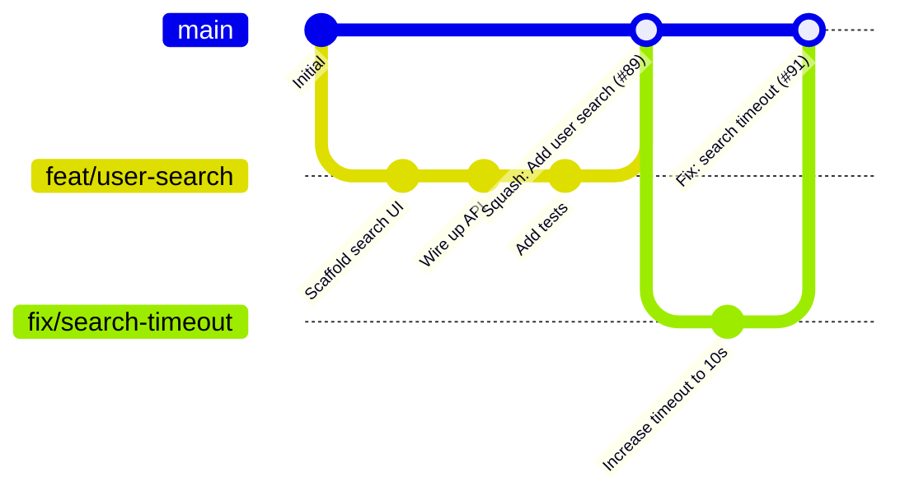
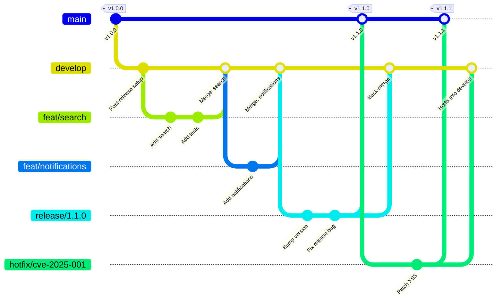
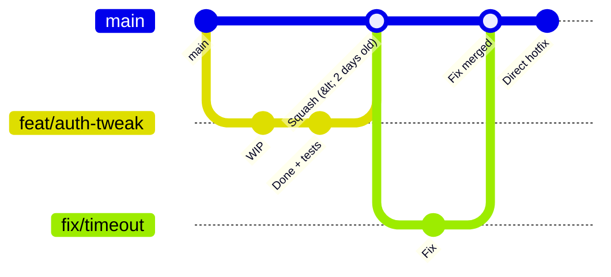

<div align="center">

# 05 · Git Workflows & Branching Strategies

### GitHub Flow · GitFlow · Trunk-Based Development · Release Management

[](./04-advanced.md)
[](./README.md)

</div>

---

## Table of Contents

1. [The Core Problem Workflows Solve](#1-the-problem)
2. [GitHub Flow — Simplicity First](#2-github-flow)
3. [GitFlow — Structured Release Management](#3-gitflow)
4. [Trunk-Based Development — Engineering at Scale](#4-trunk-based-development)
5. [Environment Branch Model](#5-environment-branch-model)
6. [Release Strategies](#6-release-strategies)
7. [Choosing the Right Workflow](#7-choosing-the-right-workflow)
8. [Commit Message Standards](#8-commit-message-standards)

---

## 1. The Problem

Every team that uses Git faces the same questions:

- Where does new feature work happen?
- How do hotfixes get deployed without shipping half-finished features?
- How do we support multiple released versions simultaneously?
- How do we avoid merge conflicts on a large team?

A **branching workflow** answers these questions by establishing a contract that everyone on the team follows.

> **Note:** No workflow is universally correct. The right choice depends on team size, deployment cadence, and release model.

---

## 2. GitHub Flow

GitHub Flow is the simplest possible workflow that still provides safety. Used by GitHub itself and recommended for teams deploying continuously.

### Rules

1. `main` is always deployable
2. All work happens on a feature branch
3. Open a PR early and often
4. Merge only after CI passes and review is approved
5. Delete branches after merge

### The Cycle



### Commands

```bash
# 1. Start work
git switch main
git pull
git switch -c feat/user-search

# 2. Develop and commit frequently
git add -p
git commit -m "feat(search): scaffold search component"
git commit -m "feat(search): wire up ElasticSearch API"

# 3. Push and open a PR early (as draft)
git push -u origin feat/user-search
gh pr create --draft --title "feat: user search [WIP]"

# 4. When ready, mark for review
gh pr ready
gh pr edit --add-reviewer alice,bob --add-label "feature"

# 5. After approval and CI pass — merge
gh pr merge --squash --delete-branch

# 6. Update local main
git switch main && git pull
```

### GitHub Flow Branch Naming

```
feat/<short-description>    New feature
fix/<short-description>     Bug fix
chore/<short-description>   Tooling, dependencies, config
docs/<short-description>    Documentation only
refactor/<short-description>  Refactoring with no behavior change
test/<short-description>    Tests only
ci/<short-description>      CI configuration

Examples:
feat/oauth2-login
fix/null-pointer-in-user-service
chore/upgrade-node-20
docs/add-api-authentication-guide
```

### When GitHub Flow Works Well

- [x] Small to medium teams (1–30 engineers)
- [x] Continuous deployment to production
- [x] Single production version (SaaS)
- [x] Fast feature turnaround (days, not months)
- [ ] Not ideal for: complex release schedules, multiple supported versions

---

## 3. GitFlow

GitFlow, introduced by Vincent Driessen in 2010, is a rigid branching model for teams with scheduled releases and maintenance of multiple deployed versions.

### Branch Roles

| Branch | Purpose | Lifetime | Merges Into |
|--------|---------|---------|------------|
| `main` | Released production code (tagged) | Permanent | — |
| `develop` | Integration branch for features | Permanent | — |
| `feat/*` | Feature development | Temporary | `develop` |
| `release/*` | Release preparation | Temporary | `main` + `develop` |
| `hotfix/*` | Emergency production fix | Temporary | `main` + `develop` |

### The Full Flow



### Feature Branch Lifecycle

```bash
# Start a feature (branching from develop)
git switch develop && git pull
git switch -c feat/user-notifications

# Develop and commit
git commit -m "feat(notifications): add email digest"

# Finish feature (merge back to develop)
git switch develop && git pull
git merge --no-ff feat/user-notifications
git push origin develop
git branch -d feat/user-notifications
git push origin --delete feat/user-notifications
```

### Release Branch Lifecycle

```bash
# Start a release (when develop is feature-complete)
git switch develop && git pull
git switch -c release/1.2.0

# Bump version, write changelog, final bug fixes only
npm version minor   # Updates package.json to 1.2.0
git commit -am "chore: bump version to 1.2.0"

# Fix any release-specific issues
git commit -m "fix: timezone handling in release notes"

# Finish release — merge to main AND back to develop
git switch main
git merge --no-ff release/1.2.0
git tag -a v1.2.0 -m "Release 1.2.0"

git switch develop
git merge --no-ff release/1.2.0

git branch -d release/1.2.0
git push origin main develop --follow-tags
```

### Hotfix Lifecycle

```bash
# Critical bug in production — branch from main, NOT develop
git switch main && git pull
git switch -c hotfix/cve-2025-001

# Apply the minimal fix
git commit -m "fix(security): patch XSS in template renderer (CVE-2025-001)"

# Merge to main (release to production)
git switch main
git merge --no-ff hotfix/cve-2025-001
git tag -a v1.2.1 -m "Security patch: CVE-2025-001"

# Also merge to develop (prevent regression)
git switch develop
git merge --no-ff hotfix/cve-2025-001

git branch -d hotfix/cve-2025-001
git push origin main develop --follow-tags
```

### When GitFlow Works Well

- [x] Desktop/mobile apps with versioned releases
- [x] Enterprise software with formal release cycles
- [x] Multiple supported versions in production simultaneously
- [x] QA team needs a stable `release` branch to test against
- [ ] Overkill for: SaaS products, small teams, teams deploying >daily

---

## 4. Trunk-Based Development

Trunk-Based Development (TBD) is the model used by Google, Meta, and Netflix. All engineers commit directly to `main` (the "trunk") or via very short-lived branches.

### Core Principles

1. **One shared branch** — everyone integrates to `main`
2. **No long-lived feature branches** — branches live ≤ 2 days
3. **Feature flags** — incomplete features hidden at runtime, not in branches
4. **Always releasable** — `main` is production-ready at every commit
5. **Fast CI** — test suite must complete in minutes, not hours

### Short-Lived Branches (Recommended TBD Pattern)



### Feature Flags

Feature flags let incomplete work ship to production safely:

```typescript
// Feature flag service
import { flags } from "@myorg/flags";

async function renderNavigation(user: User) {
  // Gate by user cohort during rollout
  if (await flags.isEnabled("new-nav", { userId: user.id })) {
    return <NewNavigation />;
  }
  return <LegacyNavigation />;
}
```

```yaml
# Feature flag configuration (LaunchDarkly / Unleash / etc.)
flags:
  new-nav:
    enabled: true
    rollout:
      percentage: 10          # Ship to 10% of users
      targeting:
        - userId: ["alice", "bob"]   # Internal users get 100%
```

**Flag lifecycle:**

```
Create flag → Develop behind flag → Ship to prod (flag off) →
Enable for 10% → Enable for 50% → Enable for 100% →
Remove flag + dead code (important!)
```

### Branch by Abstraction (Alternative to Flags)

For large refactors, introduce an abstraction layer that routes to the old or new implementation:

```typescript
// Abstraction layer — both implementations coexist
interface PaymentProcessor {
  charge(amount: Money, card: Card): Promise<Receipt>;
}

class LegacyStripeProcessor implements PaymentProcessor { ... }
class NewStripeV3Processor implements PaymentProcessor { ... }

// Route to new implementation gradually
function getProcessor(): PaymentProcessor {
  return config.useNewStripe
    ? new NewStripeV3Processor()
    : new LegacyStripeProcessor();
}
```

### When TBD Works Well

- [x] Large engineering organizations (100+ engineers on same codebase)
- [x] Teams with strong automated testing
- [x] Continuous deployment pipelines
- [x] Teams willing to invest in feature flag infrastructure
- [ ] Difficult for: open source projects (external contributors), small teams without CI discipline

---

## 5. Environment Branch Model

Some teams use long-lived environment branches. This is common in regulated industries.

```
feature branches
       ↓ (PR + merge)
    develop ──────────────→ Dev environment (auto-deploy)
       ↓ (PR + merge)
    staging ──────────────→ Staging environment (auto-deploy)
       ↓ (PR + approval)
      main  ──────────────→ Production environment (manual approval)
```

```bash
# Promote a set of changes from staging to production
git switch main && git pull
git merge --no-ff staging -m "Release: promote staging to production [2025-01-15]"
git push origin main
```

> **Warning:** Environment branches cause "merge debt" — the further behind `staging` or `develop` fall from `main`, the harder merges become. Enforce a policy that any hotfix merged to `main` is immediately back-merged to all environment branches.

---

## 6. Release Strategies

### Semantic Versioning

All release strategies should follow SemVer:

```
MAJOR.MINOR.PATCH[-prerelease][+build]

1.0.0           → First stable release
1.1.0           → New feature, backward compatible
1.1.1           → Bug fix, backward compatible
2.0.0           → Breaking change
2.0.0-rc.1      → Release candidate
2.0.0-beta.3    → Beta release
2.0.0-alpha.1   → Alpha release
0.x.y           → Pre-1.0, anything can break
```

### Release Types

| Type | Branch | Tag | Timeline |
|------|--------|-----|----------|
| **Regular** | `main` after sprint | `v1.2.0` | Scheduled |
| **Hotfix** | From `main` (GitFlow) or directly on `main` (TBD + rollback) | `v1.2.1` | Emergency |
| **Pre-release** | `release/1.3.0-rc` or main with flag | `v1.3.0-rc.1` | Before GA |
| **LTS** | `maintenance/1.x` | `v1.8.2` | Long support |

### Changelog Automation

**[Conventional Commits](https://www.conventionalcommits.org/) → automatic changelog:**

```bash
# With standard-version
npx standard-version          # Bumps version, generates CHANGELOG.md, creates tag

# With release-please (GitHub Action by Google)
# .github/workflows/release-please.yml
uses: google-github-actions/release-please-action@v4
with:
  release-type: node
  package-name: "@myorg/my-package"
```

**Generated `CHANGELOG.md` format:**

```markdown
## [2.1.0](compare/v2.0.0...v2.1.0) (2025-01-15)

### Features

* **auth:** add OAuth2 PKCE flow ([a1b2c3d](commit/a1b2c3d)), closes [#142](issues/142)
* **api:** add GraphQL endpoint ([e4f5a6b](commit/e4f5a6b))

### Bug Fixes

* **search:** fix null pointer when query is empty ([7c8d9e0](commit/7c8d9e0))
* **ui:** correct button alignment on mobile ([b1c2d3e](commit/b1c2d3e)), closes [#189](issues/189)

### BREAKING CHANGES

* **api:** `GET /users` no longer returns `password_hash` field
```

### Long-Term Support (LTS) Branches

```bash
# When v2.0 is released, create an LTS branch for v1.x
git switch -c maintenance/1.x v1.8.0
git push origin maintenance/1.x

# Backport a security fix to v1.x
git switch maintenance/1.x
git cherry-pick abc1234            # Pick the fix from main
git tag -a v1.8.1 -m "Security: CVE-2025-001"
git push origin maintenance/1.x --follow-tags
```

---

## 7. Choosing the Right Workflow

```
Step 1: How often do you deploy to production?
├── Multiple times per day ─────────────────────────────→ GitHub Flow or TBD
└── On a release schedule (weeks/months)
    │
    Step 2: Do you maintain multiple versions?
    ├── Yes (v1.x and v2.x both in prod) ───────────────→ GitFlow
    └── No (one production version)
        │
        Step 3: What's your team size?
        ├── < 10 engineers ──────────────────────────────→ GitHub Flow
        ├── 10–50 engineers ─────────────────────────────→ GitHub Flow + environments
        └── 50+ engineers ───────────────────────────────→ Trunk-Based Development
```

### Comparison Table

| Criterion | GitHub Flow | GitFlow | Trunk-Based |
|-----------|:-----------:|:-------:|:-----------:|
| **Complexity** | Low | High | Medium |
| **Branching overhead** | Minimal | Significant | Minimal |
| **Merge conflict risk** | Low | High | Very low |
| **Parallel version support** | No | Yes | No |
| **Requires feature flags** | No | No | Yes |
| **Deploy frequency possible** | Continuous | Weekly+ | Continuous |
| **CI sophistication needed** | Medium | Low | High |
| **Learning curve** | Low | Medium | High |
| **Best team size** | Any | Any | Large |

---

## 8. Commit Message Standards

Good commit messages pay compound interest. Bad ones accumulate technical debt in your `git log`.

### Conventional Commits (Full Specification)

```
<type>[(<scope>)][!]: <description>

[body]

[footer(s)]
```

**Types:**

| Type | Changelog Section | SemVer Impact |
|------|------------------|:-------------:|
| `feat` | Features | MINOR |
| `fix` | Bug Fixes | PATCH |
| `docs` | Documentation | — |
| `style` | — | — |
| `refactor` | — | — |
| `perf` | Performance | PATCH |
| `test` | — | — |
| `build` | — | — |
| `ci` | — | — |
| `chore` | — | — |
| `revert` | Reverts | PATCH |
| `BREAKING CHANGE` footer or `!` | Breaking Changes | MAJOR |

**Examples:**

```bash
# Simple feature
git commit -m "feat(search): add full-text search using Elasticsearch"

# Bug fix with issue reference
git commit -m "fix(auth): prevent session fixation attack on login

Session ID was not being rotated after successful authentication,
allowing an attacker to fix a session ID before the victim logs in.

Fixes #234
CVE: CVE-2025-0042"

# Breaking change
git commit -m "feat(api)!: change /users response schema

BREAKING CHANGE: The password_hash field has been removed from
all user API responses. Clients must not depend on this field.

Migration guide: docs/migration/v2.md"

# Multiple issues
git commit -m "fix(ui): correct button alignment on mobile

Closes #189
Closes #201"
```

### Git Hooks for Enforcement

```bash
# .husky/commit-msg (using commitlint)
npx --no -- commitlint --edit "$1"
```

```js
// commitlint.config.js
module.exports = {
  extends: ["@commitlint/config-conventional"],
  rules: {
    "type-enum": [2, "always", [
      "feat", "fix", "docs", "style", "refactor",
      "perf", "test", "build", "ci", "chore", "revert"
    ]],
    "scope-empty": [1, "never"],        // Warn if no scope
    "subject-max-length": [2, "always", 72],
    "body-max-line-length": [2, "always", 100],
  },
};
```

### Enforcing in GitHub Actions

```yaml
- name: Validate commit messages
  uses: wagoid/commitlint-github-action@v6
  with:
    configFile: commitlint.config.js
    firstParent: false
```

---

<details>
<summary><strong>Quick Reference: Branch Naming Conventions</strong></summary>

```
# Features
feat/<jira-ticket>-short-description
feat/PROJ-123-user-notifications
feat/user-notifications              # If no ticket system

# Bug fixes
fix/<jira-ticket>-short-description
fix/PROJ-456-login-error-on-sso

# Hotfixes (GitFlow)
hotfix/<version>-description
hotfix/1.2.1-cve-2025-001

# Releases (GitFlow)
release/<version>
release/2.0.0
release/2.0.0-rc.1

# Maintenance (LTS)
maintenance/<major.minor>
maintenance/1.x
maintenance/2.0

# Infrastructure/CI
ci/upgrade-actions
ci/add-codeql
chore/update-dependencies
```

</details>

---

<details>
<summary><strong>Quick Reference: Protecting main in Every Workflow</strong></summary>

These branch protection settings apply regardless of which workflow you choose:

```yaml
# Required for any team
✅ Require a pull request before merging
✅ Require status checks to pass (CI, linting)
✅ Require branches to be up to date

# Recommended additions
✅ Require signed commits
✅ Restrict who can push to matching branches
✅ Do not allow bypassing the above settings (even for admins)

# For GitHub Flow and TBD (always deployable)
✅ Require linear history (forces squash or rebase)
✅ Dismiss stale reviews when new commits are pushed

# For GitFlow
✅ Protect develop branch with same rules as main
✅ Allow admins to bypass (for release/hotfix merges)
```

</details>

---

**← Back to Index:** [README](./README.md)

---

<div align="center">

*End of GitHub Mastery Guide*

**Modules:** [Fundamentals](./01-fundamentals.md) · [Collaboration](./02-collaboration.md) · [Actions](./03-actions.md) · [Advanced](./04-advanced.md) · [Workflows](./05-git-workflows.md)

</div>
